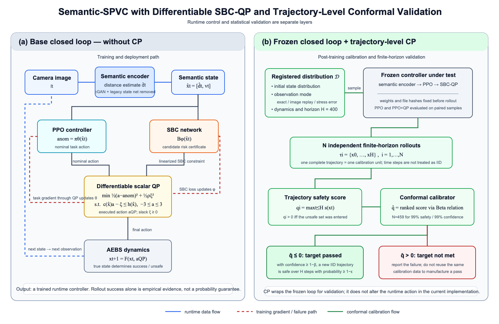

# 当前实验效果、QP 作用与后续实验路线汇报

更新时间：2026-09-28

> 本文档是当前项目的**后续研究方向总表**。已经实现的内容、尚未解决的问题、QP 消融、SBC/QP 区域统一、反例回灌、可学习约束强度、语义误差，以及新增的 CP 验证路线，都统一维护在这里。逐次运行数据仍记录在 `QP_逐步实验记录.md`。

## 1. 先说结论

目前已经完成的是：

> **语义编码器 → PPO 控制器 → 基于 SBC 条件的可微 QP → 环境下一状态**

这条代码链已经能够训练、保存、重新加载和运行。早期20个固定起点用于确认链路跑通；最新一轮已把原AEBS初始区域细分成32×32、共1024个固定起点，并在5种语义观测条件下对PPO和PPO+QP进行配对全面评估：

| 模式 | PPO success / unsafe | PPO+QP success / unsafe | QP干预 | 正slack |
| --- | ---: | ---: | ---: | ---: |
| 准确语义 | 1024 / 0 | 1024 / 0 | 4.23% | 35.02% |
| 真实数据图像最近邻重放 | 1024 / 0 | 1024 / 0 | 4.55% | 32.09% |
| 契约内均匀误差 | 986 / 38 | 986 / 38 | 2.90% | 34.17% |
| 随机契约边界 | 870 / 154 | 869 / 155 | 2.70% | 33.56% |
| 逐步最坏契约端点 | 0 / 1024 | 0 / 1024 | 6.93% | 64.74% |

每个控制器合计运行5120条轨迹。PPO成功3904条、unsafe 1216条；PPO+QP成功3903条、unsafe 1217条。合计数只是五种测试模式的描述统计，不能解释成实际道路概率。

因此，目前最准确的判断是：

1. **系统工程链条已经跑通。**QP 已经接在网络末端，也能把梯度传回控制器。
2. **最新模型在准确语义和有限图像重放中保住了原 PPO 的控制能力。**两组均为1024/1024成功；之前“一训练就全部不安全”的问题，通过从原 PPO 初始化并降低控制器学习率得到缓解。
3. **全面评估没有显示 QP 带来额外安全收益。**均匀误差下unsafe数相同，随机边界下QP多1条unsafe，最坏端点下二者全部unsafe。
4. **还不能把当前 QP 称为严格安全层。**它经常使用 `slack` 放宽内部条件，而且原 SPVC 验证代码的区间上界实现存在问题。
5. **下一阶段不应该继续盲目加训练轮数。**需要先让 SBC 训练范围、QP 施加约束的范围和验证范围一致，再做严格消融实验。
6. **trajectory-level CP 已经跑通三层评价。**准确语义和已有真实图像最近邻重放均通过 99%安全率/99%置信度目标；区间内均匀大误差压力测试失败。最新1024起点评估与该结论一致，但它本身不使用CP，也不产生置信度声明。

## 2. 当前完整框架是什么

### 2.1 数据流

```text
真实图像
   │
   ▼
语义编码器
   │  输出：估计的障碍物距离及不确定度
   ▼
语义状态：距离 + 车速
   ├──────────────────────────────┐
   │                              │
   ▼                              ▼
PPO 控制器                    SBC 网络 B(x)
   │ 输出名义动作 a_nom            │ 产生下一步风险下降条件
   └──────────────┬───────────────┘
                  ▼
               可微 QP
                  │ 输出最终动作 a_safe
                  ▼
               AEBS 环境
                  │
                  ▼
               下一状态
```



图的可编辑矢量版本：[`semantic-spvc-cp-framework.svg`](../../../figures/semantic-spvc-cp-framework.svg)。左侧是运行时与训练链，右侧是模型冻结后的trajectory-level CP；CP当前不参与每一步动作求解。

需要特别注意：早期20回合闭环使用模拟器提供的**准确语义状态**。当前已新增“每步从400张数据集中选取距离最近的真实图像→语义编码器→PPO→QP”的重放闭环并完成CP校准；但它复用有限数据集，不是连续渲染的新图像，也不覆盖真实摄像头分布变化。

### 2.2 四个模块分别做什么

#### 语义编码器

它把图像转成控制真正需要的低维信息——障碍物距离。这样保留了“图像感知”这一步，但不再使用原 SPVC 的 cGAN 生成图像和旧 `state_net` 反推距离。

#### PPO

PPO 是已有的神经网络控制器。它根据距离和速度给出一个动作，称为**名义动作** `a_nom`。在这个 AEBS 环境中，动作范围是 `[-3,3]`，正值表示更强的制动。

这里要区分两个概念：原控制器最初是通过 PPO 强化学习获得的；当前 QP 联合训练阶段沿用 SPVC 的控制器损失微调网络，并没有重新执行一整套标准 PPO 采样、优势估计和概率比更新。

#### SBC

SBC 可以先通俗地理解为一个状态评分网络 `B(x)`：希望初始区域分数低，不安全区域分数高，并希望执行动作后，下一步的平均分数不要增大。

这个“评分”不是直接测出来的碰撞概率。只有当初始区、不安全区、全域非负性、一步下降、扰动处理和验证方法等理论条件都正确满足时，它才可能成为安全证书。

#### QP

QP 是 Quadratic Programming，中文是二次规划。它在 PPO 给出动作之后，再解一个很小的优化问题：

```text
尽量保持 PPO 原动作
同时尽量满足 SBC 给出的下降条件
同时满足动作上下限
```

因此，QP 的理想作用不是重新规划整条轨迹，而是在每个控制时刻，把 PPO 动作修正成“距离原动作最近、又满足安全条件”的动作。

## 3. 当前 QP 到底解了什么问题

### 3.1 希望满足的 SBC 条件

设当前状态为 `x`，动作是 `a`，过程扰动为 `w`，下一状态为：

```text
x_next = F(x, a, w)
```

希望满足：

```text
扰动下的下一步平均 SBC 分数 − 当前 SBC 分数 ≤ 0
```

即：

```text
E_w[B(F(x,a,w))] − B(x) ≤ 0
```

左侧称为**残差**：

- 残差 `≤0`：按这项计算，下降条件通过；
- 残差 `>0`：下降条件没有通过。

残差是 SBC 网络分数的变化，不是停车距离，也不是碰撞概率。

### 3.2 为什么要线性化

SBC 是神经网络，所以 `B(F(x,a,w))` 对动作 `a` 通常是非线性的。但标准 QP 要求约束对决策变量是线性的。因此当前实现先在 PPO 名义动作附近求导，用一条切线近似原条件：

```text
c(x) × a ≤ h(x)
```

QP 实际满足的是这个局部线性近似，不是直接求解原始非线性条件。

当前代码还把原 SPVC 的二维过程扰动范围分成 `10×10` 个格子，用每个格子的中心点近似扰动期望。因此需要区分：

1. 理论上真正想满足的扰动期望条件；
2. `10×10` 格中心得到的数值近似；
3. 在 PPO 动作附近进一步线性化后放入 QP 的条件。

第 3 项通过，不自动意味着第 1 项对连续状态和所有扰动都成立。

### 3.3 当前软约束 QP

当前实现大致为：

```text
min  0.5 × (a − a_nom)² + 0.5 × ρ × slack²

subject to
     c × a − slack ≤ h
     -3 ≤ a ≤ 3
     slack ≥ 0
```

其中：

- `a_nom`：PPO 给出的动作；
- `a`：QP 最终选择的动作；
- `ρ`：slack 惩罚权重，当前固定为 `100`；
- `slack`：约束放宽量。

## 4. 什么是正 slack

`slack` 可以翻译成**放宽量**。

例如有一个简单规则：“最终动作必须小于等于 1”。如果 PPO 想输出 `1.5`，硬约束 QP 必须把动作改到 `1` 或更小。软约束 QP 允许最终动作是 `1.1`，但需要记录 `slack=0.1` 并承担惩罚。

因此：

- `slack=0`：QP 不需要放宽它内部的线性化条件；
- `slack>0`：QP 放宽了条件，严格条件没有满足。

正 slack 可能有两种来源：

1. 在动作范围 `[-3,3]` 内确实不存在满足条件的动作；
2. 存在满足条件的动作，但它离 PPO 动作太远，软 QP 权衡后宁可付 slack 代价。

本实验中的“正 slack 率 `35.07%`”表示：20 个 PPO+QP 回合的所有执行步中，约 35.07% 的步出现 `slack>10⁻⁶`。它不是：

- 35.07% 的回合发生事故；
- 35.07% 的动作一定不安全；
- 系统只有 64.93% 的安全概率。

最大 slack `5.512706` 也不是 5.51 米或 5.51 m/s，它只是 SBC 线性化条件中的数值放宽量。

此外，`slack=0` 也不等于安全已经得到证明，因为 QP 满足的仍是格中心和局部线性化后的近似条件。

## 5. 实验是怎样一步步发展到现在的

### 5.1 语义替换版 SPVC

首先只把原 SPVC 的 cGAN 和旧状态网络替换为语义编码器，其余 PPO、SBC、训练和旧验证口径尽量保留。

原程序曾输出：

- `0/10000 violations`；
- 安全到达概率下界 `96.151%`。

但后续审计发现，原 `VTVerifier` 传给自动区间传播库的不是正确的区间输入。程序标成“区间上界”的数值实际与小格下角点的普通网络值一致。因此，这两个数字可以作为**原代码复现结果**记录，但不能作为已经核实的形式化安全结论。

### 5.2 最初接入 QP 后没有效果

使用旧语义-SPVC 保存的 PPO/SBC 权重测试时：

- PPO：`0/20` 成功，`20/20` 不安全；
- PPO+QP：`0/20` 成功，`20/20` 不安全；
- QP 没有产生超出普通动作裁剪的有效修正；
- 正 slack 比例约 `27.19%`。

继续按原学习率进行完整 QP 在环训练后：

- 原旧口径报告 `1/10000`；
- PPO 和 PPO+QP 仍然都是 `20/20` 不安全；
- QP 实际额外修正仍约为 `0%`；
- 正 slack 比例约 `30.56%`，最大约 `3.303841`。

把 slack 惩罚从 `100` 提高到 `10000`，闭环结果没有变化。这说明单纯“把 slack 罚得更重”不能解决问题。

### 5.3 找到关键原因：控制器被后续训练带坏

在同一个初始状态 `d=15.5 m、v=2.75 m/s` 上：

- 原始预训练 PPO：88 步成功；
- 之前语义-SPVC 续训后的 PPO：74 步进入不安全区。

在相同 20 个测试起点上：

- 原始预训练 PPO：`20/20` 成功；
- 旧语义-SPVC PPO：`0/20` 成功。

这说明此前的失败首先是**控制器微调退化**，不能简单归咎于 QP。

随后从原 PPO 权重重新开始：

- 若仍使用原控制器学习率 `0.05`，只训练 512 个状态、SBC/PPO 各一轮，也会变成 `20/20` 不安全；
- 将新 QP 训练入口中的控制器学习率改为 `0.0001`，同样的最小训练后仍保持 `20/20` 成功；
- 再扩大到完整 100×100 状态网格、SBC 10 轮和控制器 1 轮，仍保持 `20/20` 成功。

注意：最新实验同时改变了**初始化模型和控制器学习率**，因此最新模型比旧模型更好，不能全部归因于 QP。

## 6. 最新实验的详细结果

### 6.1 训练设置

最新检查点目录：

```text
results/semantic_spvc_qp_original_init_lr1e4_full_20260926/
```

主要设置：

- 控制器从原预训练 PPO 初始化；
- SBC 从已有检查点继续；
- 状态网格：原 100×100，共 10000 个训练状态；
- SBC 更新：10 轮；
- PPO+QP 控制器更新：1 轮；
- QP slack 权重：`100`；
- 控制器学习率：`1e-4`；
- 原环境、动力学、奖励和动作范围保持不变。

### 6.2 闭环结果

| 指标 | PPO，不加 QP | PPO+QP | 如何理解 |
| --- | ---: | ---: | --- |
| 测试起点数 | 20 | 20 | 同一组确定性初始状态 |
| 成功 | 20/20 | 20/20 | 两组都成功 |
| 不安全 | 0/20 | 0/20 | 这 20 回合中没有触发模拟器不安全条件 |
| 超时 | 0/20 | 0/20 | 都在 400 步以内结束 |
| 平均步数 | 约 87.1 | 86.55 | QP 平均少约 0.55 步，差异很小 |
| 平均回报 | 约 20.932 | 20.929 | 基本相同 |
| QP 实际动作修正 | 不适用 | 4.16% | QP 确实在少数步骤改变了合法执行动作 |
| 正 slack | 不适用 | 35.07% | 约三分之一步放宽了 QP 内部条件 |
| 最大 slack | 不适用 | 5.512706 | 是 SBC 条件数值，不是物理单位 |

### 6.3 原网格检查输出

最新模型在原 SPVC 的旧实现口径下输出 `0/10000`。但是这不等于“正确验证了连续空间的全部 10000 个状态”：

1. 原程序先按 SBC 分数筛选，只对靠近不安全区分数的一条窄带检查下降；
2. 原区间上界调用已经确认不正确；
3. 分母仍打印 10000，容易让人误以为 10000 点都经过同样完整的下降检查。

三条代表轨迹中：

- 旧失败模型只有 `1/209` 步落入原验证筛选带；
- 新成功模型只有 `2/260` 步落入原验证筛选带；
- 新模型抽取的 90 个正 slack 状态中，只有 2 个落入该筛选带。

这解释了为什么“旧口径 `0/10000`”和“QP 正 slack 35.07%”可以同时出现：二者实际上没有在同样的状态范围上检查同一个条件。

## 7. 加了 QP 后，到底取得了什么效果

### 7.1 已经取得的效果

1. **QP 已经成为网络输出层的一部分。**训练时输出动作确实经过 QP，推理时也可以使用同一 QP。
2. **QP 可微链路有效。**一维求解器、梯度和约束动作导数的 3 个单元测试均通过。
3. **QP 确实改变了一部分动作。**最新模型中，约 4.16% 的动作变化不能仅用环境原本的动作裁剪解释。
4. **加入 QP 后没有破坏最新 PPO 的 20/20 测试成功率。**这是一个正面的工程结果。
5. **图像→语义→PPO→QP 的前向接口已跑通。**8 张真实图像样本得到有限、合法的动作。

### 7.2 尚未取得的效果

1. **没有显示 QP 提高了成功率。**PPO 本身已经是 20/20，加入 QP 后仍是 20/20。
2. **没有显示 QP 显著提高性能。**回报几乎不变，平均步数仅变化约半步。
3. **没有消除 slack。**正 slack 比例仍为 35.07%。
4. **没有形成可靠的安全证明。**原验证实现存在区间问题，QP 约束又是格中心和局部线性近似。
5. **没有完成真实图像闭环。**目前闭环仍使用准确语义状态。
6. **没有证明跨场景通用性。**当前环境、动力学、SBC 和一维动作 QP 都针对 AEBS。

所以，当前 QP 的真实评价应当是：

> **可微 QP 联合训练框架已实现，并且在小规模闭环测试中没有破坏任务成功；但 QP 的独立安全贡献尚未被实验或理论证明。**

## 8. 当前最重要的几个问题

### 问题一：SBC、QP 和验证器使用的区域不一致

SBC 原验证器只在一条很窄的分数带内要求下降；当前 QP 却在整条轨迹的每一步都尝试施加下降条件。于是大量原本没有被 SBC 训练/验证重点覆盖的状态，也被 QP 强行要求满足同一条件。

后果是：QP 会频繁使用 slack，而旧验证计数仍可能很好看。

### 问题二：当前 SBC 条件在部分状态对合法动作不可满足

对旧失败模型的 3 条轨迹：63 个正 slack 状态分别扫描 61 个合法动作，没有找到满足同一格中心 SBC 条件的候选。

对新成功模型：抽取 90 个正 slack 状态，只有 3 个在 61 个离散扫描动作里找到可行候选。

这不能证明连续动作范围绝对无解，但说明当前学到的 SBC 形状和 QP 条件不匹配。QP 不能凭空创造一个原约束下不存在的动作。

### 问题三：软 slack 与“安全保证”冲突

软 slack 的好处是 QP 几乎总能返回动作，训练更稳定；坏处是安全条件可以被放宽。如果最终论文声称 QP 负责强制安全，就需要：

- 在声明的工作域内保证硬 QP 可行；或
- 明确给出 slack 对风险上界的影响；或
- 将 slack 只用于训练和反例发现，正式验证/部署时要求为零。

当前还没有完成这一步。

### 问题四：缺少能隔离 QP 贡献的消融实验

最新模型同时改变了初始化和学习率。当前还缺少同初始化、同学习率、同训练数据下的：

1. PPO 不微调；
2. PPO 微调但没有 QP；
3. PPO+固定 QP，仅推理使用；
4. PPO+可微 QP 联合训练。

没有这组对照，就无法把效果变化归因于 QP。

### 问题五：感知误差没有进入闭环和 QP 条件

当前 QP 接收的是准确距离状态。真正运行时，距离来自语义编码器，会有偏差和不确定度。如果 QP 使用了错误的距离，即使数学求解完全正确，也可能构造出错误的安全约束。

## 9. 当前 QP 是怎么训练的

### 9.1 QP 求解器本身有没有“权重”

当前一维 QP 求解公式本身没有像神经网络那样的可训练权重。以下量是固定的：

- 动作上下限 `[-3,3]`；
- QP 中“接近 PPO 动作”的二次代价形式；
- slack 权重 `ρ=100`；
- `10×10` 扰动格中心设置。

“可微 QP”表示：最终动作对 PPO 动作、约束系数和右端项的导数可以计算，训练损失可以穿过 QP 反向传播。

当前真正被更新的是：

- PPO 控制器网络参数；
- SBC 网络参数，通过交替训练更新。

### 9.2 当前交替训练流程

```text
加载语义编码器、原 PPO 和已有 SBC
             │
             ▼
阶段 L：暂时固定 PPO/QP 动作，更新 SBC
  - 下降损失
  - 初始区/不安全区区域损失
  - Lipschitz 损失
             │
             ▼
阶段 P：固定当前 SBC，通过 QP 更新 PPO
  - QP 输出作为真正动作
  - 根据下一状态的 SBC 下降损失更新 PPO
  - 保留原控制器动作的 MSE 损失
  - 控制器 Lipschitz 损失
             │
             ▼
保存 PPO 与 SBC，重新加载后评估
```

当前 PPO 阶段的主要损失沿用原 `VTLearner`：

```text
控制器损失 ≈ 10 × SBC 下降损失
           + 10 × 与原控制器动作的 MSE
           + Lipschitz 项
```

QP 的内部目标包含 slack 惩罚，但外层训练损失目前没有单独加入“轨迹平均 slack”“QP 干预量”或“硬可行率”指标作为明确优化目标。这也是后续需要改进的地方。

## 10. QP 理想情况下应该起什么作用

QP 可以承担四种不同角色，必须明确论文选择哪一种：

### 角色 A：运行时安全投影器

PPO 给任务动作，QP 把它投影到安全可行集合。这是 BarrierNet 和 Opt-ODENet 最典型的用法。优点是每一步都能显式检查约束；缺点是部署时必须一直运行 QP，而且保证依赖 CBF/SBC、动力学和感知均正确。

### 角色 B：可微训练层

训练时让损失穿过 QP，使 PPO 主动学会输出接近可行集合的动作。理想结果是：训练后 QP 干预量逐渐下降，slack 趋近于零。

### 角色 C：安全教师

用 QP 生成安全动作，再把这些动作蒸馏给一个 standalone 控制器。部署时可以不运行 QP，但需要另外验证学生控制器没有破坏安全性。

### 角色 D：反例发现器

QP 的不可行、正 slack 或大动作修正可以暴露 SBC 与动力学不一致的状态，用这些状态回灌训练 SBC 和控制器。

当前系统已经实现了角色 B 的基本代码，也部分发挥了角色 D；角色 A 所需要的硬可行性和可靠验证尚未完成，角色 C 尚未开展。

## 11. BarrierNet 与 Opt-ODENet 的 QP 有什么区别

参考论文：

- [BarrierNet: Differentiable Control Barrier Functions for Learning of Safe Robot Control](../../references/BarrierNet_Differentiable_Control_Barrier_Functions_for_Learning_of_Safe_Robot_Control.pdf)，重点见第 V 节及公式 (7)–(11)；
- [Opt-ODENet: Neural ODE Controller Design with Differentiable Optimization Layers for Safety and Stability](../../references/Opt-ODENet.pdf)，重点见第 4 节、公式 (9)、算法 1 和实验消融。

### 11.1 BarrierNet 的 QP

BarrierNet 使用已知控制仿射动力学和 CBF/HOCBF。它的 QP 目标可以写成：

```text
min  0.5 × uᵀ H(z) u + F(z)ᵀ u

subject to
     参数化 HOCBF 硬约束
     控制输入上下限
```

其特点是：

- `H(z)` 可以学习，表示不同方向修改动作的代价；
- `F(z)` 可以学习，与参考控制或任务偏好相关；
- HOCBF 中的正 penalty `p_i(z)` 可以学习，用于根据环境调节约束保守程度；
- QP 通过 KKT 条件做隐式微分；
- 原论文主要使用 nominal/expert controller 产生参考动作或训练标签；
- 主公式中的安全 HOCBF 是**硬约束**，没有像当前实现这样默认给安全约束加 slack。

BarrierNet 所谓的“softened/differentiable HOCBF”容易被误解。它主要是通过可学习的正函数 `p_i(z)` 调整 HOCBF 的形状和保守性，不等于允许安全约束随便违反。

### 11.2 Opt-ODENet 的 QP

Opt-ODENet 的控制网络先输出 `u_nn`，然后使用：

```text
min  0.5 × ||u − u_nn||²

subject to
     CBF 硬约束
```

论文公式 (9) 中使用 `Q=I`、`q=-u_nn`，所以它就是把神经网络动作投影到最近的 CBF 可行动作。

其特点是：

- QP 二次项固定为单位阵，结构简单且天然强凸；
- 主要学习控制网络，以及 CBF 的 class-K 函数 `α` 或线性系数 `κ`；
- QP 被放进 Neural ODE 的连续时间轨迹积分中；
- 使用 CLF 型轨迹损失推动到达目标和稳定；
- 使用 ODE adjoint 加 QP 的 KKT 隐式微分训练；
- 不要求先准备一个专家安全控制器作为标签；
- 论文实验显示：只在推理阶段临时加 QP 虽能避免碰撞，但可能严重损失任务性能；把 QP 放进训练并学习 `κ`，安全与任务性能的折中更好。

### 11.3 逐项对比

| 对比项 | BarrierNet | Opt-ODENet | 当前项目 |
| --- | --- | --- | --- |
| 动力学形式 | 已知连续时间控制仿射 | 已知连续时间控制仿射 | 离散时间 AEBS 动力学 |
| 安全对象 | CBF/HOCBF | CBF，另有 HOCBF 实验 | 学到的随机 SBC |
| QP 目标 | 可学习 `H(z),F(z)` | 固定欧氏投影 `Q=I` | 固定欧氏投影式一维 QP |
| 可学习安全参数 | 正 penalty `p_i(z)` | `α` 或 `κ` | 当前没有独立可学习 QP 参数 |
| 名义控制器 | 通常需要参考/专家控制 | 控制网络由轨迹损失直接学习 | 已有 PPO |
| 任务性能训练 | 模仿/任务损失 | Neural ODE + CLF 轨迹损失 | 原 SPVC 下降、保留动作 MSE、Lipschitz |
| 安全约束 | 主公式为硬约束 | 主公式为硬约束 | 当前允许安全 slack |
| QP 是否参与训练 | 是 | 是 | 是 |
| QP 是否部署时保留 | 是 | 是 | 当前设计是保留 |
| 反向传播 | QP KKT 隐式微分 | QP KKT + ODE adjoint | 一维解析 QP 的自动微分 |
| 主要优势 | 灵活、环境自适应、支持 HOCBF | 简单、强凸、直接优化整条轨迹 | 与现有 PPO/SBC 接口最容易兼容 |
| 主要风险 | 参数多、凸性和可行性更难维护 | 训练计算量高，依赖已知 CBF/动力学 | SBC/区域错位、正 slack、验证仍不可靠 |

### 11.4 哪一种更适合当前项目

当前最合适的是：

> **先保留 Opt-ODENet 风格的固定投影目标，再逐步借用 BarrierNet 的“可学习正约束强度”，而不是一开始同时学习 QP 的 H、F 和全部约束。**

原因是：

1. 已经有 PPO，可以自然把 PPO 动作当 `u_nom`；
2. `Q=I` 的投影目标容易解释，也能保证强凸；
3. 当前最大问题不是 QP 表达能力不足，而是 SBC 条件在许多状态不适用或不可行；
4. 如果现在再学习 `H` 和 `F`，很难判断效果来自安全约束、任务代价还是数值条件变化；
5. AEBS 是离散随机系统，不能直接照搬两篇论文的连续时间 CBF 公式；应保留离散 SBC 结构，只借用“可微投影层”和“学习约束强度”的思想。

建议先增加一个受约束的正参数：

```text
κ(x) = softplus(raw_κ(x)) + κ_min
```

用它调节离散 SBC 下降强度。训练时限制它始终为正、范围有界，并保存固定 `κ` 与学习 `κ` 的消融。只有这一步稳定后，才考虑 BarrierNet 式可学习 `H`。

## 12. 后续实验应该怎样推进

后续应分五个阶段，每阶段只回答一个问题。

### 阶段 1：做干净的 QP 消融，确认 QP 本身是否有贡献

所有组使用相同的原 PPO 初始化、`1e-4` 学习率、状态数据、训练轮数和评估起点：

| 组别 | 训练时 QP | 推理时 QP | 目的 |
| --- | --- | --- | --- |
| A0 原 PPO | 否 | 否 | 原控制能力基线 |
| A1 普通微调 PPO | 否 | 否 | 判断小学习率本身的作用 |
| A2 推理 QP | 否 | 是 | 判断固定 QP 单独作用 |
| A3 可微 QP 联合训练 | 是 | 是 | 判断 QP 参与训练的作用 |

每组至少报告：

- success、unsafe、timeout；
- 平均回报和步数；
- QP 动作修正率与平均修正幅度；
- 正 slack 率、最大 slack；
- 原始和未线性化 SBC 残差；
- 相同测试状态上的逐状态配对差异。

只有 A3 明显优于 A1/A2，才能说“可微 QP 联合训练有效”。

### 阶段 2：统一 SBC 训练域、QP 作用域和验证域

先明确论文要在哪个状态集合上声称安全，然后三处使用同一集合：

1. SBC 在这个集合上训练下降条件；
2. QP 在这个集合上施加对应条件；
3. 验证器在这个集合上检查最终 QP 动作。

不能继续使用“训练覆盖全网格、验证只筛窄带、QP 又在全轨迹作用”的混合定义。

这里有两条可选路线：

- **路线 2A：全声明域下降。**在声明的全部非终止安全域训练和验证 SBC。难度更高，但逻辑最清楚。
- **路线 2B：明确局部证书域。**只对理论上需要下降的区域施加 QP，并给出进入、退出与域外控制规则。不能仅为了降低 slack 而关闭域外 QP；必须说明域外为何不需要该条件。

建议先做 2B 的严格定义验证可行性，再决定能否扩大为 2A。

### 阶段 3：用正 slack 状态做反例回灌

每轮训练执行：

```text
采样状态
   ↓
运行 PPO+QP
   ↓
收集正 slack、大修正量、原非线性残差为正的状态
   ↓
在合法动作范围内搜索可行候选
   ├─ 找得到：训练 PPO 靠近可行动作
   └─ 找不到：更新 SBC 形状/约束强度，或缩小声明域
   ↓
重新训练并复查同一批反例
```

阶段目标不是立刻把 slack 数字变成零，而是分清：

- 是控制器没有选到已有可行动作；
- 还是 SBC 自身定义导致所有合法动作都不可行。

### 阶段 4：加入 Opt-ODENet 式可学习约束强度

在 QP 目标保持 `Q=I` 的前提下，先只学习一个正的、有界的 `κ` 或低维 `κ(x)`：

```text
QP：选择最接近 PPO 的动作
约束：离散 SBC 条件 + κ 调节项
```

训练损失建议包含：

```text
L = L_task
  + λ_dec × L_SBC_decrease
  + λ_keep × ||a_nom − a_original||²
  + λ_int × ||a_safe − a_nom||²
  + λ_slack × slack²
```

其中：

- `L_task`：闭环任务表现；
- `L_SBC_decrease`：原始未线性化的离散下降损失；
- `L_keep`：避免控制器灾难性漂移；
- `L_int`：让 PPO 学会减少对 QP 的依赖；
- `L_slack`：减少软约束放宽。

注意：即使加入 `L_slack`，最终安全声明仍需要硬可行性检查，不能只看平均 slack 变小。

### 阶段 5：扩大评估并加入语义误差

在前四阶段稳定后，再进行：

1. 更密的初始状态网格，不只测试 20 点；
2. 原 SPVC 定义的过程扰动蒙特卡洛回合；
3. 精确语义、均匀语义误差、边界语义误差和最坏端点四种输入；
4. 图像→语义→PPO→QP→下一图像/状态的真正闭环；
5. 报告语义编码器误差和过程扰动分别造成的影响，不能重复计入；
6. 对最终落盘模型重新加载后验证，避免报告训练中间模型。

## 13. 每一阶段的停止条件

为了避免继续无止境试参数，建议设置明确门槛。

### 阶段 1 通过条件

- A0–A3 四组全部完成同条件对照；
- A3 至少在一项安全/约束指标上明显优于 A1/A2；
- 任务成功率不低于原 PPO。

### 阶段 2 通过条件

- SBC 训练域、QP 作用域和验证域在代码与文档中完全一致；
- 每个被声明安全的状态都实际执行了对应检查；
- 不再使用有误的旧区间调用支持安全结论。

### 阶段 3–4 通过条件

- 声明域内硬 QP 可行率达到 100%，或所有不可行状态被明确排除并解释；
- 正 slack 在正式验证模式下为 0；
- QP 干预量随训练下降，而不是依赖极端动作；
- 未线性化 SBC 残差和可靠上界检查均通过。

### 阶段 5 通过条件

- 图像闭环和语义误差实验完成；
- PPO、推理 QP、联合训练 QP 的公平消融完成；
- 报告均值、最坏值、失败类型和样本数量；
- 结论明确区分经验成功率与形式化保证。

## 14. 接下来最值得先做的一步

下一步应当先做**阶段 1 的四组公平消融**，而不是直接增加网络结构或训练轮数。

原因是当前最新模型同时更换了初始化并降低了学习率。我们已经知道它能跑通并保持 20/20 成功，但还不知道：

- 是小学习率保住了 PPO；
- 是 QP 联合训练发挥了作用；
- 还是两者共同作用。

完成 A0–A3 后，再使用正 slack 状态做反例回灌。若跳过这一对照直接学习 `κ`、`H` 或增加轮数，后续即使指标变化，也很难形成可信的论文结论。

## 15. 汇报时可以怎样概括

可以对导师这样说：

> 我们已经把原 SPVC 的图像生成式感知替换成了直接语义编码器，并在 PPO 后加入了由 SBC 条件构造的可微 QP。完整的训练、保存、加载和推理链已经跑通。最初实验全部失败，进一步分析发现主要原因不是 QP 求解器本身，而是原 SPVC 后续微调把已有 PPO 控制能力破坏了。改为从原 PPO 初始化，并将控制器学习率从 0.05 降到 0.0001 后，完整网格训练仍能在 20 个固定初始状态上保持 100% 成功。QP 在约 4.16% 的步骤中真实修改了动作，但不加 QP 的 PPO 同样 100% 成功，所以目前还不能证明 QP 带来了额外安全提升。另一个关键问题是约 35.07% 的步骤使用了正 slack，说明当前 SBC 条件、QP 作用范围和原验证范围并不一致。下一步会先做同初始化、同学习率下的四组 QP 消融，再用 slack 反例统一训练域、QP 作用域和验证域，之后才学习类似 Opt-ODENet 的正约束强度参数。

## 16. 最终判断

当前工作不是失败，也不是已经完成安全证明，而是处于以下阶段：

```text
架构实现：完成
QP 可微训练链：完成
保住控制器任务能力：初步完成
QP 独立安全收益：尚未证明
硬约束可行性：尚未完成
可靠形式化验证：尚未完成
真实图像闭环：尚未完成
跨场景通用性：尚未完成
```

QP 仍然值得继续，因为它提供了一个把“控制器想做什么”和“安全条件允许做什么”明确结合的接口，也能通过梯度参与训练。但下一步的重点不是让 QP 更复杂，而是先让 SBC、QP 和验证三者对同一个状态域、同一个最终动作和同一个安全条件负责。

## 17. 新增方向：用 Conformal Prediction 验证 RL 控制器

导师提出参考 `2503.17395v2.pdf`，考虑使用 CP 验证 RL 得到的控制器。这里的 CP 是 **Conformal Prediction，共形预测**，不是控制器本身，也不是重新训练 PPO 的一种强化学习算法。它的作用是：用一批与训练数据独立、按预先规定方式抽出的校准样本，给“一个新样本违反安全条件的概率”建立有限样本统计界。

### 17.1 参考论文实际上验证了什么

参考论文 CP-NCBF 的对象不是一个没有安全结构的裸 RL policy，而是：

```text
参考控制器（可以是 RL）
          +
神经控制障碍函数 NCBF
          +
实时 CBF-QP 修正动作
```

论文首先定义三类违反量：安全初始集的符号条件、不安全集的符号条件、以及沿闭环动力学的 CBF 导数条件。对一个随机状态，取三类违反量的最大值作为 conformal score。分数越大，违反越严重。然后在 `N` 个独立同分布状态上计算高分位数 `q_hat`，并利用论文定理中的 Beta 分布关系，把以下结论量化出来：

```text
以至少 1-beta 的置信度，
从规定状态分布重新抽取一个状态时，
其最大违反分数不超过 q_hat 的概率至少为 1-epsilon。
```

若 `q_hat>0`，论文把 `-q_hat` 作为更严格的训练裕量，重新训练 NCBF，再用**新的独立校准数据**计算分数，直到最终 `q_hat<=0` 或达到停止次数。论文假设连续时间 control-affine 动力学、已知 `f,g`，并通过 NCBF-QP 执行动作。论文附录给出的训练规模为 20K 或 50K 状态点；文中脚注只给出了两种基线方法代码，当前没有在论文中找到所提 CP-NCBF 方法本身的官方代码地址，所以本项目需要按公式实现，不能直接声称复用了作者代码。

### 17.2 CP 能不能直接证明“RL 控制器正确”

不能不加限定地这样说。“正确性”必须先变成一个明确、可计算的事件，而且概率一定是相对于某个抽样分布而言。CP 可以支持的准确表述是：

> 对从指定初始状态、感知误差和过程扰动分布产生的一个新样本或新轨迹，以给定置信度，其安全违反分数不超过校准阈值的概率至少达到某个水平。

它不能自动推出以下结论：

- 连续状态空间的每个状态都安全；
- 任意未建模的天气、图像或动力学变化都安全；
- 从现在开始无限长时间永不失败；
- 换一个采样分布或换一个控制器，原保证仍然有效；
- 一步违反概率为 1% 就等于 400 步整条轨迹的失败概率也是 1%。

尤其要注意：普通 split CP 需要校准样本和未来测试样本可交换，通常落实为独立同分布。不能把同一条轨迹的 400 个时间步当作 400 个独立样本。对闭环控制，最稳妥的做法是把**一整条独立轨迹作为一个校准样本**，每条轨迹只产生一个最大违反分数。

### 17.3 对当前项目的可行性判断

| 目标 | 可行性 | 原因 |
| --- | --- | --- |
| 冻结 RL 控制器，给有限时域轨迹安全率做 CP 校准 | **高** | 现有 AEBS 已能从给定初始状态完整 rollout，并明确记录 success/unsafe/timeout；只需增加独立轨迹采样、轨迹分数、分位数和置信参数计算。 |
| 按论文思想验证当前离散 SBC+QP | **中等** | 当前有已知离散动力学、SBC、QP 和状态采样接口，但论文是连续时间 CBF，必须重新推导离散随机违反分数；当前正 slack 和作用域不一致也要先处理。 |
| 用 CP 证明连续全状态、无限未来绝对安全 | **低/不可直接做到** | CP 给的是抽样分布下的概率保证，不是全域最坏情况证明；无限时域还需要有效的不变性/SBC 定理及可行的 QP。 |
| 图像闭环的 CP 保证 | **中等，后置** | 语义编码器已有独立 calibration/test 划分，但当前闭环仍使用真实语义状态；需要先把图像误差作为轨迹随机性接入。 |

因此，这条方向**值得做，而且比继续解释旧 `0/10000` 更可靠**，但应该分两层：先做直接面向冻结 RL 控制器的有限时域 trajectory-level CP；再做更接近论文、用于训练和校准 SBC-QP 的 CP-SBC。第一层最快回答导师“RL 控制器在规定分布下有多可靠”；第二层才可能成为论文的方法创新。

### 17.4 最快可实现的方案：轨迹级 CP 验证冻结控制器

先固定一个最终控制器检查点。控制器可以是 PPO，也可以是 PPO+QP；两者必须分别校准，不能把其中一个的结果转移给另一个。冻结后不得再更新语义编码器、PPO、SBC 或 QP，否则必须丢弃旧校准结果并重新校准。

#### 第一步：把概率问题写清楚

第一版建议固定：

- 时域 `H=400`，与当前 `AebsEnv` 最大回合长度一致；
- 初始状态分布：在原初始区域 `d∈[15,16] m、v∈[2.5,3] m/s` 均匀采样；
- 控制器：分别测试冻结 PPO 和冻结 PPO+QP；
- 第一版先使用当前确定性动力学和准确语义状态；
- 后续再单独加入过程扰动分布和图像/语义误差分布；
- `worst_endpoint` 继续作为压力测试，不混进 IID 概率保证，除非明确给它定义抽样概率。

这意味着第一版结论只针对“原初始分布、400 步、当前模拟器、准确语义状态”。

#### 第二步：每条轨迹只计算一个分数

二值分数可以直接记录回合是否出现 `unsafe`，但它只给失败率，不反映离失败边界还有多远。建议同时保存连续轨迹分数：

```text
r_t = min((6-d_t)/distance_scale, (v_t-0.5)/speed_scale)
s_trajectory = max over t=0..H of r_t
```

只有“距离进入 6 m 内”和“速度超过 0.5 m/s”同时成立时，`r_t>0`；因此 `s_trajectory>0` 表示该轨迹进入了当前定义的不安全集合，`s_trajectory<=0` 表示在该有限时域内没有进入。两个 scale 只用于把米和米每秒变成无量纲数，必须训练前固定，不能看结果后调整。

每条轨迹使用独立初始状态和独立随机扰动序列。轨迹内部的时间相关性不影响“以轨迹为一个样本”的做法；不同轨迹之间才要求独立同分布。

#### 第三步：严格划分数据

```text
训练集：训练 PPO/SBC/QP
校准集：只计算 conformal 分数和 q_hat
测试集：最后一次经验核对，不参与选模型、调 alpha 或调网络
压力测试集：worst endpoint、边界网格、分布外情况，只报告，不并入 IID 保证
```

若根据校准结果重训或选择检查点，这批校准数据就已经参与了模型选择，不能再用于最终声明；必须生成新的最终校准集。此前用于调学习率、查 slack、选择最好权重的 20 个固定起点也不能充当最终独立校准集。

#### 第四步：计算 CP 阈值与置信结论

对 `N` 个轨迹分数排序，按 split conformal 的有限样本秩规则取高分位数 `q_hat`。同时按参考论文定理，根据 `N`、分位参数 `alpha` 和 Beta 分布关系报告最终的 `epsilon` 与 `beta`，不能只输出一个“99%”而不解释它是覆盖率、置信度还是经验成功率。

若最终 `q_hat<=0`，可以说高概率的新轨迹在规定的 400 步内不进入不安全集合；若 `q_hat>0`，CP 仍然给出了违反严重程度的概率上界，但不能宣称目标安全率通过。

作为样本量直觉：如果只采用“校准中零次不安全”的二项式特例，要以 `1-beta` 的置信度声称失败概率不超过 `epsilon`，至少需要

```text
N >= log(beta) / log(1-epsilon)
```

| 目标有限时域安全率 | 置信度 | 校准中零失败时至少需要的独立轨迹数 |
| --- | ---: | ---: |
| 95% | 95% | 59 |
| 99% | 95% | 299 |
| 99% | 99% | 459 |
| 99.9% | 95% | 2995 |
| 99.9% | 99% | 4603 |

所以现在的 `20/20` 成功远不足以支撑 99% 安全率的高置信结论。正式实现应使用论文的连续分数和 Beta/秩计算；上表只用于说明数量级和检查程序输出是否合理。

#### 第五步：必须输出什么

每个冻结控制器分别输出：

- `N, H, alpha, epsilon, beta`；
- 初始状态、过程扰动、感知误差的抽样分布；
- `q_hat`、轨迹分数最大值和分位数；
- 校准与独立测试的 unsafe/success/timeout 数量；
- 若有 QP：干预率、正 slack 率和求解失败数；
- 声明适用范围和明确不覆盖的分布外压力测试。

### 17.5 更接近参考论文的方案：离散 CP-SBC-QP

当前项目的 SBC 采用“初始区低、不安全区高、下一步期望值下降”的符号，与论文“安全区 `h>=0`、不安全区 `h<0`、导数条件非负”的符号不同。因此不能直接复制论文公式。按当前记号，可定义三个违反分数：

```text
q_init(x)   = B(x) - initial_upper_target
q_unsafe(x) = unsafe_lower_target - B(x)
q_dec(x)    = E_w[B(F(x, pi_QP(x), w))] - B(x) + decrease_margin
```

分数 `<=0` 表示对应条件满足，`>0` 表示违反。这里必须使用**最终实际执行动作** `pi_QP`，不能用 PPO 原动作训练、再对 QP 动作作结论。期望中的 `w` 必须对应明确的过程扰动分布；感知误差应通过策略输入单独采样，不能和过程扰动重复计算。

参考论文把三种分数取最大后统一校准。当前项目的初始区、不安全区和下降域来自不同集合，第一版更建议分别分层采样和校准三个分数，再预先分配总的 `alpha/beta` 风险预算。这样能直接看出是区域值条件失败，还是下降条件失败，也避免大量“不适用状态的零分数”掩盖问题。

训练循环为：

```text
1. 用训练数据在 margin=0 下训练 SBC，并固定当前 PPO+QP；
2. 在独立校准集上计算 q_init、q_unsafe、q_dec；
3. 若某项 q_hat>0，把对应训练目标收紧 q_hat 大小；
4. 重新训练 SBC，必要时再小步更新 PPO+QP；
5. 丢弃已使用的校准集，用全新的独立校准集重新计算；
6. 所有目标 q_hat<=0 或达到预定停止次数后，冻结模型；
7. 用最终未使用过的校准集和测试集报告结果。
```

这条路线能自然利用当前 QP 层：SBC 的 CP 裕量进入 QP 约束，PPO 仍提供任务动作，QP 输出实际动作。不过当前 `35.07%` 正 slack 表明很多步放宽了 SBC 条件；只要正式运行仍允许正 slack，就不能把“QP 始终执行 CP 校准后的硬条件”作为前提。因此 CP-SBC 正式声明前，需要先做到声明域内 QP 硬可行，或把 slack 本身纳入失败分数并接受相应概率结论。

### 17.6 与现有 QP 路线怎样衔接

CP 不替代前面 A0-A3 的公平消融，两者回答不同问题：

- A0-A3 回答“QP 和联合训练有没有带来额外效果”；
- trajectory CP 回答“冻结后的某个控制器在规定轨迹分布和有限时域下，安全率能以多大置信度下界”；
- CP-SBC 回答“学出的 SBC 条件在规定状态分布下，以多大概率成立，并如何用校准裕量重新训练”。

推荐顺序调整为：

```text
P0  冻结现有 PPO 与 PPO+QP，确定 H 和抽样分布
P1  实现 trajectory-level CP，只做评估，不改网络
P2  完成 A0-A3 公平消融，选出真正要验证的最终控制器
P3  对最终控制器生成全新校准集，给出正式有限时域 CP 结果
P4  统一 SBC 训练域、QP 作用域、验证域并消除声明域内正 slack
P5  实现离散 CP-SBC 违反分数与 margin-retraining
P6  加入过程扰动、语义误差和图像闭环，分别重新校准
```

### 17.7 最小代码交付规划

第一阶段只新增独立目录，不修改原 SPVC 训练器：

```text
Aebs/conformal/controller_trajectory_score.py
    负责独立生成回合并计算每条轨迹的最大安全违反分数

Aebs/conformal/calibrate_controller.py
    负责 conformal 分位数、Beta 置信关系、零失败样本量检查

Aebs/conformal/evaluate_controller.py
    重新加载冻结模型，在独立测试集报告经验结果

results/conformal/<controller_name>/
    保存预先声明的配置、逐轨迹分数、校准结果和测试结果
```

第二阶段再新增 `sbc_scores.py` 与 `train_cp_sbc.py`，不要一开始同时修改 PPO、SBC、QP 和感知模块。所有输出都保存模型文件哈希、配置和数据随机种子，确保“被校准的模型”和最终加载的模型完全一致。

### 17.8 主要风险和停止条件

| 风险 | 处理方法 |
| --- | --- |
| 校准分布与部署分布不一致 | 在配置中固定并保存分布；分布改变就重新校准；分布外测试只作压力测试。 |
| 同一轨迹时间步被误当 IID | 每条轨迹只生成一个最大分数；轨迹之间独立。 |
| 用校准集选模型造成数据泄漏 | 每次重训或选权重后换新校准集；最终测试集始终封存。 |
| 将有限时域误写成无限安全 | 报告中始终写明 `H=400`；无限时域必须另有不变性定理。 |
| CP 只验证常见状态，漏掉罕见危险边界 | 同时保留 worst-endpoint 和边界网格压力测试；不能把它们冒充 IID 保证。 |
| QP 使用正 slack | 将 slack>0 作为单独违反事件；CP-SBC 硬保证前要求声明域内 slack 为零。 |
| 当前原 VT 区间实现有误 | CP 新模块直接从已定义分数和独立样本计算，不依赖旧 `0/10000`；区间验证若保留，必须使用修正实现。 |

停止条件：若轨迹级 CP 在合理样本量下 `q_hat>0`，先报告控制器未达到目标，不通过反复挑校准集制造通过；若 CP-SBC 多轮收紧后仍存在大量正 slack 或任务成功率明显下降，则保留 trajectory CP 作为评价工具，暂停将 CP-SBC 称为已成功的方法贡献。

### 17.9 最终可对导师怎样回答

> 该方向可行，但要区分“用 CP 统计验证冻结 RL 控制器”和“按论文用 CP 训练并验证神经屏障函数”。论文直接校准的是 NCBF 三类条件的违反分数，RL 控制器的安全性还依赖已知动力学和 NCBF-QP 始终执行这些条件。对当前 AEBS，最快且最严谨的第一步是把一整条 400 步闭环轨迹作为一个独立样本，校准轨迹最大安全违反分数，从而给冻结 PPO 与 PPO+QP 在原初始分布下的有限时域安全率下界。之后再把当前离散 SBC 的初始区、不安全区和一步下降条件改写成 conformal scores，通过 `q_hat` 收紧训练裕量并重新训练。CP 能给分布相关的概率保证，不能替代全域、无限时域的确定性证明。当前工程接口足够，第一层实现难度低，第二层可行但需要先解决 QP 正 slack 和 SBC/QP/验证区域不一致。

### 17.10 本节依据

- 本地论文：`2503.17395v2.pdf`，重点对应论文第 4.2 节 Theorem 2、Algorithm 1，第 4.3 节 Algorithm 2，以及附录 A、B、D。
- 官方条目：<https://arxiv.org/abs/2503.17395>。
- 论文脚注中出现的公开代码是 Lipschitz NCBF 基线 `Stochastic-NCBF` 和未验证 NCBF 基线 `neural_clbf`；截至本次调研，论文正文没有提供 CP-NCBF 主方法的官方仓库链接。

### 17.11 第一版 trajectory-level CP 已实现并自动实验

实现日期：2026-09-27。新增：

- `Aebs/conformal/calibrate_controller.py`：一次性完成预登记、冻结模型哈希、批量闭环、轨迹分数、CP 秩/Beta 置信关系、独立测试与 PPO/QP 配对比较；
- `tests/test_conformal_controller.py`：3 个数据无关单元测试；
- `Aebs/conformal/README.md`：固定实验范围和复现命令。

程序在运行轨迹前先写 `config.json`，避免看结果后改分布或指标；若输出目录非空则拒绝覆盖。最终检查点为 `results/semantic_spvc_qp_original_init_lr1e4_full_20260926/`，两个模型文件的 SHA-256 已写入配置。PPO 与 PPO+QP 使用完全相同的初始状态，便于配对比较。

#### Smoke：先验证代码和数量级

```bash
python -m pytest -q tests/test_conformal_controller.py
python -m Aebs.conformal.calibrate_controller \
  --calibration-episodes 59 --test-episodes 20 \
  --epsilon 0.05 --beta 0.05 \
  --output-dir results/conformal/trajectory_cp_smoke_20260927
```

单元测试 `3 passed`。59 条校准轨迹对应“至少 95% 有限时域安全率、至少 95% 置信度”的最坏分数秩；PPO 与 PPO+QP 校准均 `59/59` success、独立测试均 `20/20` success，`q_hat` 分别为 `-0.076426485` 和 `-0.074365799`，完成 smoke 后才运行正式实验。

#### 正式实验：99% 安全率、99% 置信度

```bash
python -m Aebs.conformal.calibrate_controller \
  --calibration-episodes 459 --test-episodes 200 \
  --epsilon 0.01 --beta 0.01 \
  --output-dir results/conformal/trajectory_cp_99_99_final_20260927
```

| 指标 | 冻结 PPO | 冻结 PPO+QP |
| --- | ---: | ---: |
| 校准轨迹 | 459 | 459 |
| 校准 success / unsafe | 459 / 0 | 459 / 0 |
| 独立测试 success / unsafe | 200 / 0 | 200 / 0 |
| 最坏秩 `l` | 1 | 1 |
| `q_hat` | `-0.076305373` | `-0.073926447` |
| 实际置信度下界 | 99.0079% | 99.0079% |
| 校准平均步数 | 87.240 | 86.773 |
| 测试平均步数 | 87.005 | 86.535 |
| QP 动作干预率（校准/测试） | 0 / 0 | 4.218% / 4.241% |
| 正 slack 率（校准/测试） | 0 / 0 | 34.964% / 35.038% |

两个 `q_hat` 均小于零，因此在**预登记的准确语义、确定性动力学、均匀初始状态、400 步范围**内，两个冻结控制器都通过：以至少 `99.0079%` 的置信度，新独立轨迹的分数不超过各自 `q_hat` 的概率至少为 `99%`。这里的概率来源只剩初始状态随机性；不能外推到图像误差、过程扰动、分布偏移或无限未来。

配对结果没有显示 QP 更安全。轨迹分数越低越远离 unsafe 集；校准集中 `QP-PPO` 分数差平均为 `+0.002351349`，QP 更低/更高/相同分别为 `181/278/0` 条。独立测试中 QP 更低/更高为 `75/125` 条，平均差约 `+0.002308`。因此 QP 平均少约半步完成任务，但在当前分数下略微更靠近边界；未做显著性结论。该结果与此前“PPO 本来已经 20/20 成功，QP 尚无额外安全收益”的判断一致。

最终服务器目录与本地同步目录均为 `results/conformal/trajectory_cp_99_99_final_20260927/`，包含：

- `config.json`：运行前登记的分布、模型哈希、样本数和结论边界；
- `metrics.json`：CP、经验结果、QP 指标及配对差异；
- `trajectory_data.npz`：全部初始状态、轨迹分数、结局、步数、干预和 slack 数据。

#### 本步解决了什么、还没有解决什么

- **已解决**：不再用 `20/20` 直接冒充高安全率；现在有独立轨迹、有限样本秩和明确置信度的第一版 CP 结果。校准单位正确设为整条轨迹，没有把相关时间步伪装成 IID。
- **已解决**：冻结模型和运行分布已预登记，模型哈希和逐轨迹数据可审计；PPO/QP 使用相同样本，比较公平。
- **未解决**：当前环境在给定初始状态后完全确定，结论没有覆盖原 SPVC 假定的过程扰动，也没有覆盖语义编码器误差。
- **未解决**：两个模型都通过，且 PPO 的安全分数平均略优；CP 验证成功不等于 QP 方法贡献成功。
- **未解决**：QP 仍约 35% 正 slack；trajectory CP 只验证最终轨迹事件，不会自动修复 SBC/QP 条件。

下一步最快、最有信息量的扩展是保持模型冻结，在轨迹生成器中加入**一个明确且唯一的随机来源**。优先加入真实可解释的语义距离误差；若只能采用原 SPVC 人工过程扰动盒，则必须明确标为假设分布，并与语义误差分开实验。每改变一次分布，都要生成新的独立校准集，原 99%/99% 结果不能直接沿用。

### 17.12 第二轮：语义误差压力测试与真实图像重放

实现日期：2026-09-27。本轮仍冻结语义编码器、PPO、SBC 和 QP，只改变并预登记“控制器实际看到的距离”，没有用测试结果更新模型。`calibrate_controller.py` 新增两种互不混淆的模式，单元测试由 3 项增加到 4 项并全部通过。

#### A. 区间内均匀误差：严格压力测试失败

命令：

```bash
python -m Aebs.conformal.calibrate_controller \
  --semantic-mode uniform_contract \
  --calibration-episodes 459 --test-episodes 200 \
  --epsilon 0.01 --beta 0.01 \
  --output-dir results/conformal/trajectory_cp_uniform_semantic_99_99_20260927
```

该模式在每个控制步根据**真实距离所在分箱**读取语义契约半径，再独立采样 `Uniform(-radius,+radius)` 距离误差；速度保持准确、动力学不加过程噪声。PPO 与 QP 使用完全相同的初始状态和误差序列。

| 指标 | PPO | PPO+QP |
| --- | ---: | ---: |
| 校准 success / unsafe | 443 / 16 | 443 / 16 |
| 独立测试 success / unsafe | 194 / 6 | 192 / 8 |
| 校准 unsafe 率 | 3.486% | 3.486% |
| 测试 unsafe 率 | 3.0% | 4.0% |
| `q_hat` | `+0.024503191` | `+0.025823199` |
| 结论 | 99%/99% 不通过 | 99%/99% 不通过 |
| 平均绝对距离误差（校准） | 0.400m | 0.399m |
| 最大绝对距离误差 | 2.776m | 2.776m |

失败是实质性的，不能通过换一个分位数或隐藏 unsafe 回合改成“通过”。独立测试也复现了失败。QP 的配对分数平均比 PPO 高 `0.000879`（分数越低越安全），测试 unsafe 还多 2 条，因此当前 QP 没有吸收这种大语义误差。

随后直接检查语义校准数据，定位到 80 个校准样本中的一个异常点：数据集索引 138 的真实距离为 `8.467m`，编码器预测 `5.692m`，误差 `-2.776m`。其所在 `7.75–10.5m` 分箱只有 22 个校准样本，另外 21 个样本的绝对误差最大仅约 `0.102m`；为了达到原状态分箱契约的覆盖要求，单个异常点把整个分箱半径扩大到 `2.776m`。均匀压力模式进一步把这个半径解释成每一步都可能等概率出现正负大误差，所以会频繁生成原 80 个校准样本里未出现的 `+2m` 以上过估计。该测试仍有价值：它说明控制器对“大幅高估距离”不鲁棒；但它不是语义编码器真实经验误差分布，不能单独代表图像闭环性能。

#### B. 数据集最近图像重放：当前可实现的图像闭环通过

为了不把人工均匀区间等同于真实图像分布，新增 `dataset_nearest`：每个控制步按车辆真实距离，从 `Downsampled.h5` 的 400 张图像中选择标签距离最近的一张，实际运行语义编码器得到点预测，然后将 `[预测距离, 准确速度]` 输入 PPO→QP。真实车辆状态仍用于动力学和 unsafe 判断。配置文件额外保存图像数据文件 SHA-256。

命令：

```bash
python -m Aebs.conformal.calibrate_controller \
  --semantic-mode dataset_nearest \
  --calibration-episodes 459 --test-episodes 200 \
  --epsilon 0.01 --beta 0.01 \
  --output-dir results/conformal/trajectory_cp_image_replay_99_99_20260927
```

| 指标 | PPO | PPO+QP |
| --- | ---: | ---: |
| 校准 success / unsafe | 459 / 0 | 459 / 0 |
| 独立测试 success / unsafe | 200 / 0 | 200 / 0 |
| `q_hat` | `-0.077554999` | `-0.083473600` |
| 实际置信度下界 | 99.0079% | 99.0079% |
| 校准平均步数 | 88.634 | 88.608 |
| 测试平均步数 | 88.440 | 88.280 |
| 平均绝对距离误差（校准） | 0.078m | 0.080m |
| QP 干预率（校准/测试） | 0 / 0 | 4.541% / 4.548% |
| 正 slack 率（校准/测试） | 0 / 0 | 31.974% / 32.091% |

两种控制器都通过登记的 99%/99% 有限时域目标。图像重放确实会经过异常帧，最大误差仍约 `2.788m`，但该异常是**低估距离**，会让控制器更早制动而不是把障碍物看远，所以没有产生 unsafe。校准配对中 QP 分数更低/更高为 `302/157`，平均差 `-0.000585`；独立测试为 `126/74`，但平均差 `+0.000415`。这些差异很小，不能据此宣称 QP 显著提高安全性。

#### 本轮能够说什么，不能说什么

- **能够说**：在 400 张已有图像的最近距离重放、原初始分布、确定性动力学和 400 步内，PPO 与 PPO+QP 都获得了 99% 安全率/99% 置信度的 trajectory CP 结果。
- **能够说**：把语义契约的最坏半径当成每步均匀误差后，两者都未达到目标；当前 QP 对大幅距离高估不鲁棒。
- **不能说**：400 张图像重放等于真实摄像头连续视频。相邻距离复用了同一图像，光照、姿态和新场景没有变化。
- **不能说**：语义契约覆盖率与闭环安全率可以相乘得到安全保证；二者的抽样单位和依赖关系不同。
- **仍未解决**：QP 约 32% 正 slack，CP 只验证最终轨迹事件，未证明 SBC 条件始终成立；当前成功仍主要来自 PPO 本身。

因此最快评价路线已经形成三层：准确语义基准通过、现有真实图像重放通过、人工区间压力失败。下一步不再重复增加 CP 轨迹数。若目标是提高方法贡献，优先实现参考论文的离散 CP-SBC margin-retraining；若目标是提高图像结论外推性，优先收集独立的新图像轨迹并按整条轨迹重新校准，而不是继续复用 400 张训练数据。
