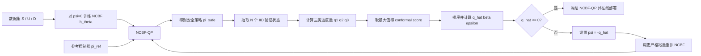

# CP-NCBF 论文中的 CP 怎么用：整体框架、公式与通俗解释

> 论文：*CP-NCBF: A Conformal Prediction-based Approach to Synthesize Verified Neural Control Barrier Functions*  
> 对应文件：[2503.17395v2.pdf](../references/2503.17395v2.pdf)  
> 重点位置：Figure 1、公式 (5)–(12)、Theorem 2、Algorithm 1、Algorithm 2、Appendix A–B。

## 1. 先说最核心的结论

这篇论文中的 CP（Conformal Prediction，共形预测）**不是直接验证一个裸 RL 控制器是否正确，也不是运行时修改动作的 safety filter**。

它的核心用途是：

1. 先训练一个神经控制屏障函数 NCBF；
2. 把 NCBF 的三类安全条件分别写成“违反分数”；
3. 在一批独立同分布的状态样本上计算这些违反分数；
4. 用 split conformal prediction 得到一个高置信的违反上界 `q_hat`；
5. 如果 `q_hat>0`，说明当前 NCBF 仍存在超过目标比例的安全条件违反；
6. 将 `-q_hat` 作为更严格的训练裕量，重新训练 NCBF；
7. 最终得到 NCBF 后，把它放进 CBF-QP，在线修正参考控制器动作。

一句话概括：

> **CP负责测量“当前NCBF还差多少”，这个差值再变成训练裕量；NCBF-QP负责在线执行安全动作。**

## 2. 论文要解决什么问题

### 2.1 普通 CBF 的理想条件

论文考虑连续时间 control-affine 系统：

```text
x_dot = f(x) + g(x)u
```

其中：

- `x`：系统状态；
- `u`：控制输入；
- `f(x)`：无控制时的自然动力学；
- `g(x)u`：控制输入对动力学的影响。

定义一个连续可微函数 `h(x)`，并用它定义安全集合：

```text
C = {x : h(x) >= 0}
```

即：

- `h(x)>0`：安全集合内部；
- `h(x)=0`：安全边界；
- `h(x)<0`：安全集合外部。

若要让 `h` 成为有效 CBF，需要存在控制动作使：

```text
L_f h(x) + L_g h(x)u + kappa(h(x)) >= 0
```

这里：

```text
L_f h(x) = dh/dx * f(x)
L_g h(x) = dh/dx * g(x)
```

这个条件的直观含义是：系统在安全边界附近不能继续朝不安全方向穿出去。若初始状态在安全集合内，并且控制策略始终满足该条件，安全集合就保持正不变。

### 2.2 为什么用神经网络以后难验证

复杂系统很难人工构造 `h(x)`，所以论文用神经网络 `h_theta(x)` 表示 NCBF。

问题在于：神经网络只在有限训练点上优化。即使训练点上的损失很小，也不能说明连续状态空间中没有遗漏违反点。

传统方案可能使用：

- 非常密集的状态网格；
- 神经网络全局 Lipschitz 上界；
- 精确神经网络验证；
- 混合整数规划或 SMT。

这些方法可能计算量大，或者因为使用全局最坏界而过度保守。论文希望用有限独立样本给出**分布相关的概率保证**，并降低保守性。

## 3. 论文的完整框架

论文 Figure 1 的流程可以整理成下面三阶段。



### 阶段一：学习 NCBF

论文准备三类数据：

- `S`：从初始安全集合 `X_s` 中采样；
- `U`：从初始不安全集合 `X_u` 中采样；
- `D`：从完整状态空间 `X` 中采样，用于导数条件。

NCBF训练的目标是同时满足：

```text
h_theta(x) >= 0             for x in X_s
h_theta(x) < 0              for x in X_u
dh_theta/dx * (f+gu) + kappa(h_theta) >= 0    for x in X
```

### 阶段二：用 CP 量化 NCBF 违反程度

在模型固定以后，论文重新从状态空间采样 `N` 个 IID 状态。对每个状态计算三类违反分数，并取最大值作为一个 conformal score。

### 阶段三：把 conformal score 变成训练裕量

如果校准得到 `q_hat>0`，说明当前NCBF仍存在正违反。论文令：

```text
psi = -q_hat
```

因为 `psi` 变成负数，训练条件会比“刚好小于等于零”更严格。重新训练以后，希望所有分数整体向负方向移动，最终重新校准时得到：

```text
q_hat <= 0
```

达到这个条件后，再在线部署 NCBF-QP。

## 4. 三类违反分数到底是什么

论文公式 (8) 定义：

```text
q1(x) = -h_theta(x) * 1_Xs
q2(x) = (h_theta(x) + delta) * 1_Xu
q3(x) = - dh_theta/dx * (f(x)+g(x)u(x)) - kappa(h_theta(x))
```

其中 `delta>0` 是一个小数，用于保证不安全集合上的严格负值要求。

### 4.1 `q1`：初始安全集合符号条件

希望：

```text
h_theta(x) >= 0, x in X_s
```

改写为违反量：

```text
q1(x) = -h_theta(x)
```

因此：

- `q1<=0`：初始安全点满足要求；
- `q1>0`：安全点被NCBF错误地放到了负侧。

### 4.2 `q2`：不安全集合符号条件

希望：

```text
h_theta(x) <= -delta, x in X_u
```

改写为：

```text
q2(x) = h_theta(x) + delta
```

因此：

- `q2<=0`：不安全点被正确放在负侧，并留出 `delta` 间隔；
- `q2>0`：不安全点与安全集合的分离不够。

### 4.3 `q3`：CBF导数条件

希望：

```text
dh_theta/dx * (f+gu) + kappa(h_theta) >= 0
```

论文把它乘以负号写成违反量：

```text
q3(x) = -dh_theta/dx * (f+gu) - kappa(h_theta)
```

因此：

- `q3<=0`：当前策略下的CBF导数条件满足；
- `q3>0`：状态转移可能朝不安全方向违反屏障条件。

### 4.4 为什么取三者最大值

对一个状态定义：

```text
s(x) = max(q1(x), q2(x), q3(x))
```

只有当 `s(x)<=0` 时，三类条件才都不为正。

所以 `s(x)` 是非常自然的安全违反总分：

- 负数：三类条件都满足；
- 0附近：接近边界；
- 正数：至少有一类条件违反；
- 正数越大：论文用它表示违反越严重。

这就是论文交给 conformal prediction 的 score。

## 5. CP具体怎样计算

### 5.1 独立校准状态

固定当前 `h_theta` 和它诱导的控制策略以后，从状态分布中采样：

```text
x_1, x_2, ..., x_N ~ IID distribution over X
```

计算：

```text
s_j = max(q1(x_j), q2(x_j), q3(x_j))
```

注意：论文 Theorem 2 和 Algorithm 1 的基本校准单位是**状态样本**，不是一整条轨迹。Figure 1 使用了“Rollouts”的图示，但定理中明确写的是从 `X` 采样 `N` 个 IID states。

### 5.2 排序和 `q_hat`

论文将分数从大到小排列：

```text
S_1 >= S_2 >= ... >= S_N
```

给定内部参数 `alpha`：

```text
l = floor((N+1)*alpha)
q_hat = S_l
```

等价地，论文 Theorem 2 将 `q_hat` 写成相应的高分位数。

这里从大到小排序，因此较小的 `l` 对应更靠近最坏情况的分数，也会更保守。

### 5.3 `alpha`、`epsilon`、`beta`不是同一个东西

论文用三个容易混淆的参数：

- `alpha`：选择校准分数秩/分位数的内部参数；
- `epsilon`：允许的状态违反概率上限；目标安全水平是 `1-epsilon`；
- `beta`：对这条概率结论允许的置信失败概率；置信度是 `1-beta`。

它们通过正则化不完全Beta函数联系：

```text
I_(1-epsilon)(N-l+1, l) <= beta
```

当这个条件成立时，Theorem 2 给出：

```text
with probability at least 1-beta:
P_x( max_i q_i(x) <= q_hat ) >= 1-epsilon
```

通俗解释：

> 以至少 `1-beta` 的置信度，从同一状态分布再抽取一个新状态时，它的三类NCBF违反量都不超过 `q_hat` 的概率至少为 `1-epsilon`。

### 5.4 `q_hat`的符号意味着什么

#### `q_hat>0`

论文认为存在目标比例之外的正安全违反，而且 `q_hat` 的大小刻画违反严重程度。此时当前NCBF还不能达到目标。

#### `q_hat<=0`

由Theorem 2可知，以至少 `1-beta` 的置信度：

```text
P_x(s(x) <= q_hat) >= 1-epsilon
```

而 `q_hat<=0`，因此这些状态同时满足 `s(x)<=0`，也就是三类NCBF条件在至少 `1-epsilon` 的分布质量上成立。

需要注意：这仍然是**相对于采样状态分布的概率保证**，不是“连续状态空间每一个点都严格满足”的确定性最坏情况证明。

## 6. `psi`怎样进入训练

论文把连续状态空间中的理想最坏违反问题写成 robust optimization problem：

```text
minimize psi
subject to q_k(x) <= psi, for all x in X and k in {1,2,3}
```

因为连续空间包含无限约束，实际训练使用有限场景样本，并构造损失：

```text
L1 = average ReLU(q1(x)-psi), x in S
L2 = average ReLU(q2(x)-psi), x in U
L3 = average ReLU(q3(x)-psi), x in D

L_theta = L1 + lambda1*L2 + lambda2*L3
```

### 第一次训练：`psi=0`

这时只要求训练点上的分数不为正：

```text
q1<=0, q2<=0, q3<=0
```

论文解释说，如果一开始就设很大的负裕量，容易让安全集合过度保守，所以先从0开始。

### CP发现违反以后：`psi=-q_hat`

若 `q_hat=0.03`，则：

```text
psi = -0.03
```

新的训练目标变成：

```text
q1<=-0.03
q2<=-0.03
q3<=-0.03
```

也就是说，在训练点上主动留出0.03的负裕量，用来抵消神经网络在未见状态上的泛化误差。

这就是CP结果参与训练的真正方式：

> **CP不直接改网络参数；它把校准出来的违反量转成鲁棒裕量，损失函数再用这个裕量重训网络。**

## 7. NCBF-QP在整体框架中的作用

论文假设已有一个参考控制器：

```text
pi_ref(x)
```

它可能任务表现很好，但没有安全保证。在线时求解：

```text
pi_safe(x) = argmin_u ||u-pi_ref(x)||^2

subject to:
L_f h_theta(x) + L_g h_theta(x)u + kappa(h_theta(x)) >= 0
```

QP做两件事：

1. 最终动作尽量接近参考动作，减少任务性能损失；
2. 最终动作满足由NCBF产生的线性控制约束。

因此完整职责分工为：

| 模块 | 作用 |
| --- | --- |
| 参考控制器 `pi_ref` | 完成跟踪、导航、避障等任务目标 |
| NCBF `h_theta` | 定义安全集合并产生导数安全条件 |
| NCBF-QP | 在线把参考动作最小幅度修正成满足NCBF条件的动作 |
| CP | 离线量化NCBF条件违反，并产生重训裕量 `psi` |

## 8. Algorithm 1和Algorithm 2分别在做什么

### Algorithm 1：Safety Quantification of Neural CBF

输入：动力学 `f,g`、样本数 `N`、分位参数 `alpha`。

流程：

1. 从状态空间抽取 `N` 个IID状态；
2. 对每个状态计算总违反分数 `s(x)`；
3. 把分数从大到小排序；
4. 计算秩 `l=floor((N+1)alpha)`；
5. 用Beta关系得到对应 `epsilon,beta`；
6. 取第 `l` 个分数作为 `q_hat`；
7. 返回 `q_hat,beta,epsilon`。

它回答：

> 当前固定NCBF在指定状态分布下，三类条件的高置信违反上界是多少？

### Algorithm 2：Training Robust Neural CBFs

流程：

1. 准备安全集、不安全集和全域状态样本；
2. 令 `psi=0`；
3. 训练NCBF直到当前训练损失收敛；
4. 调用Algorithm 1得到 `q_hat`；
5. 令 `psi=-q_hat`；
6. 使用新裕量重新构造损失；
7. 再次训练NCBF；
8. 返回最终 `h_theta`。

正文进一步描述：可以重复“校准—更新裕量—重训”，直到 `q_hat<=0` 或达到最大迭代次数。

## 9. 论文中的CP保证究竟保证什么

### 能保证的内容

在下列前提下：

- NCBF和控制策略在校准时已经固定；
- 校准状态与未来状态服从相同分布并满足可交换/IID条件；
- 三类分数实现与理论公式一致；
- `epsilon,beta,N,l` 满足Theorem 2的Beta关系；

可以说：

> 以至少 `1-beta` 的置信度，一个新的同分布状态满足 `s(x)<=q_hat` 的概率至少为 `1-epsilon`。

若再有 `q_hat<=0`，则可把它解释成三类NCBF条件以至少 `1-epsilon` 的概率成立。

### 不能直接保证的内容

它不能直接推出：

- 连续状态空间每个点都满足条件；
- 任意分布外状态都安全；
- 任意长时间轨迹绝对不会失败；
- 任意感知误差和过程扰动都已覆盖；
- 一个没有CBF结构的裸RL控制器已经被证明正确。

论文的概率对象首先是**状态上的NCBF条件违反**。若要进一步得到整个闭环轨迹的安全概率，还需要CBF理论前提、控制器始终满足约束、状态分布解释以及轨迹相关性的进一步论证。

## 10. 一个必须注意的数据使用问题

标准 split conformal 的前提是：模型固定以后，使用未参与模型选择或训练的校准集。

如果先在某个校准集上计算 `q_hat`，再根据这个 `q_hat` 重训NCBF，那么该NCBF已经依赖这批校准数据。若继续在同一批数据上报告最终CP结论，严格的独立校准前提会受到影响。

论文 Algorithm 2 展示了“计算 `q_hat`—设置 `psi=-q_hat`—重训”的流程，正文还提到可重复迭代，但没有在算法伪代码中清楚展开每轮是否更换全新的校准集。

工程上更稳妥的做法是：

```text
训练集：更新NCBF参数
第1校准集：估计裕量并决定是否重训
若模型发生更新：丢弃第1校准集
第2校准集：重新校准更新后的模型
...
最终校准集：只用于最终一次概率声明
独立测试集：只用于经验复核
```

这样可以避免“用校准结果训练模型，又用同一结果证明模型”的数据泄漏。

## 11. 论文实验得到什么效果

论文测试了：

1. 三维地面车辆避障；
2. 六维飞行器地理围栏；
3. 八维四足机器人动态障碍物避让。

主要观察为：

- 未验证NCBF的零水平集可能与不安全区域重叠；
- CP-NCBF和Lipschitz验证基线都能避免这种重叠；
- CP-NCBF通常得到更大的安全集合，即相对不那么保守；
- 要求从99.5%提高到99.9%时，安全集合会更保守；
- 状态维数较高时，密集网格/Lipschitz基线难以扩展，而采样式CP更容易扩展。

论文附录报告的训练规模：

| 任务 | NCBF结构 | 训练点 | Epoch |
| --- | --- | ---: | ---: |
| 地面车辆 | 1层、每层64 | 20K | 1000 |
| 飞行器 | 2层、每层128 | 20K | 1500 |
| 四足机器人 | 2层、每层128 | 50K | 5000 |

作为对比，论文称Lipschitz约束基线在地面车辆任务使用了约54M个密集状态—动作样本，并难以扩展到高维任务。

Figure 10还显示：

- 训练/验证样本增多时，conformal score通常下降；
- 目标安全水平越严格，conformal score通常越高；
- 更严格的安全目标需要更多样本或更保守的NCBF。

## 12. 为什么说它比全局Lipschitz方法不那么保守

全局Lipschitz验证通常需要一个适用于整个状态空间的最坏变化率。神经网络在局部变化很平缓，但全局Lipschitz常数可能被少量极端区域拉得很大，从而要求非常密集的采样或非常大的鲁棒裕量。

CP-NCBF不要求覆盖每一个最坏点，而是允许预先指定一个很小的违反概率 `epsilon`。因此它可以忽略目标概率之外的少数离群状态，换取：

- 更大的安全集合；
- 更少的样本；
- 更好的高维扩展性。

代价是保证从“所有状态最坏情况”变成“指定分布下、高置信的概率保证”。

## 13. 最容易误解的几个点

### 误解一：CP直接生成安全动作

不对。在线安全动作由NCBF-QP生成；CP主要在离线阶段计算 `q_hat` 和训练裕量。

### 误解二：`99.9% safety`等于现实事故率不超过0.1%

不严谨。论文的直接定理对象是指定状态分布下NCBF条件分数的覆盖概率。能否等同到现实事故率，取决于状态分布、系统模型、CBF定理和部署条件是否全部对应。

### 误解三：`q_hat`是NCBF真实全域最大违反

不对。论文Remark 1明确说，它是违反量的概率上界工具，并不直接估计真实robust optimization最优值 `psi*`。

### 误解四：样本多就一定不保守

样本增多会让概率估计更稳定，并使 `alpha`、`epsilon`更接近；但最终保守性还受网络能力、训练质量、状态采样分布和目标安全等级影响。

### 误解五：重训后可以继续使用同一校准集正式宣称保证

严格split conformal要求最终模型与最终校准集保持独立。模型根据校准结果更新后，应当使用新的独立校准数据重新作最终声明。

## 14. 与“对RL控制器做轨迹级CP”的区别

这篇论文与直接trajectory-level CP并不是同一件事：

| 对比项 | 论文CP-NCBF | 轨迹级控制器CP |
| --- | --- | --- |
| 校准对象 | NCBF三类条件违反量 | 一整条闭环轨迹的最大安全违反 |
| 一个样本 | 一个IID状态 | 一条IID初始化的完整轨迹 |
| score | `max(q1,q2,q3)` | `max_t unsafe_score(x_t)` |
| CP结果怎样使用 | 变成 `psi=-q_hat`，重训NCBF | 通常只评价冻结控制器是否达到目标 |
| 是否依赖CBF理论 | 是 | 可直接定义轨迹事件，不一定需要CBF |
| 概率含义 | 状态分布上的NCBF条件覆盖 | 轨迹分布上的有限时域安全事件覆盖 |
| 在线动作 | NCBF-QP | 被评估控制器本身，可有或没有QP |

所以若导师说“参考这篇论文，用CP验证RL控制器”，需要先明确选择：

1. **严格沿论文路线**：先建立有效NCBF/CBF-QP，再对NCBF条件做CP校准和margin retraining；
2. **直接验证RL轨迹**：把完整rollout作为样本，对最终安全事件作CP；实现更快，但不是论文原本的CP-NCBF训练方法。

## 15. 把论文方法迁移到当前AEBS时应怎样对应

论文是连续时间CBF，而当前AEBS主要使用离散时间SBC。因此不能直接复制导数公式，需要做离散化对应。

可以定义：

```text
q_init(x)   = B(x) - initial_upper_target
q_unsafe(x) = unsafe_lower_target - B(x)
q_dec(x)    = E_w[B(F(x, pi_QP(x), w))] - B(x) + margin
```

这里采用当前项目“初始区低、不安全区高”的SBC符号，因此与论文 `h>=0` 安全、`h<0` 不安全的符号相反。

然后：

```text
s(x) = max(q_init(x), q_unsafe(x), q_dec(x))
```

再使用独立校准状态计算 `q_hat`。若 `q_hat>0`，把训练目标收紧相应幅度，并用新校准集重新检查。

迁移时必须满足：

- score使用QP最终执行动作，而不是只用PPO名义动作；
- 明确状态采样分布；
- 感知误差与过程扰动分开；
- 正slack要作为违反或可行性问题处理；
- 每次更新SBC或QP后使用新的独立校准数据；
- 不把状态级概率自动写成无限时域轨迹安全概率。

## 16. 最后总结

这篇论文的创新不是“给一个现成控制器套一个CP数字”，而是把CP嵌入NCBF训练闭环：

```text
训练NCBF
→ 用NCBF-QP形成闭环策略
→ 对NCBF三类条件做状态级CP校准
→ 得到高置信违反阈值q_hat
→ 用psi=-q_hat收紧NCBF训练
→ 重新校准
→ q_hat<=0后部署NCBF-QP
```

它用有限状态样本换取分布相关、可调置信度的概率保证，避免了全局Lipschitz方法所需的大规模密集采样，并通常得到更大的安全集合。

与此同时，它不是连续全域最坏情况证明。结论依赖状态采样分布、IID/可交换性、正确实现的违反分数、固定模型与独立校准数据，以及NCBF-QP在部署时真正执行CBF条件。

## 17. 导师提出的“用CP验证RL控制器”是否可行

### 17.1 结论

可行，但必须把“验证RL控制器正确”改写成一个严谨、有限定条件的命题：

> 对一个已经冻结的RL控制器，在预先规定的初始状态、感知误差和动力学分布下，用一条完整闭环轨迹作为一个校准样本。CP可以用有限数量的独立轨迹，为新同分布轨迹在有限时间内不进入不安全集合的概率给出带置信度的下界。

CP不能据此证明：

- 控制器在连续状态空间的每一点都绝对安全；
- 控制器在任意未见分布下都安全；
- 控制器在无限时间内都安全；
- 动力学模型错误、传感器分布变化以后结论仍然成立；
- 一个已经大量失败的控制器会被CP自动修好。

因此，论文中可以写“有限时域、分布相关、有限样本概率验证”，不能写“CP证明RL控制器在所有情况下完全正确”。

### 17.2 当前项目选择的第一阶段：轨迹级CP

当前实现没有把同一条轨迹中的每一个时间步错误地当成独立样本，而是规定：

```text
一组独立初始条件和随机误差
→ 冻结控制器完成一次最多400步的闭环运行
→ 整条轨迹只产生一个安全违反分数
→ 一条轨迹是一个CP校准样本
```

这是因为同一轨迹相邻时间步高度相关，不满足简单的IID假设。不同独立初始化的完整轨迹更适合作为校准单位。

当前AEBS不安全状态定义为：

```text
distance <= 6 m  且  speed > 0.5 m/s
```

每个时间步的分数定义为：

```text
r_t = min((6-d_t)/1m, (v_t-0.5)/1mps)
```

整条轨迹的分数为：

```text
s_trajectory = max_t r_t
```

这里 `min` 表示距离条件和速度条件必须同时成立，`max_t` 表示只要轨迹中有一个时间步进入不安全集合，就记为发生违反。因此：

- `s_trajectory>0`：轨迹进入过不安全集合；
- `s_trajectory<=0`：轨迹在登记的有限时域内没有进入不安全集合；
- 分数越大：进入不安全集合的程度越严重。

### 17.3 当前CP实验怎样产生结论

当前登记的正式实验配置是：

- 初始距离：`Uniform(15,16)` m；
- 初始速度：`Uniform(2.5,3.0)` m/s；
- 最大时域：400个控制步，即20秒；
- 动力学：原AEBS确定性动力学；
- 被验证模型：冻结的PPO，以及冻结的PPO+SBC-QP；
- CP目标：至少99%的新同分布轨迹安全；
- 置信度目标：至少99%；
- 校准轨迹：459条；
- 独立经验测试轨迹：200条；
- 采用从最坏到最好排序的第1名分数作为 `q_hat`；
- 实际得到的置信度下界：99.0079%。

若最终：

```text
q_hat <= 0
```

则可以在当前登记范围内表述：

> 以至少99.0079%的置信度，一条新的同分布轨迹在20秒内不进入配置的不安全集合的概率至少为99%。

若：

```text
q_hat > 0
```

则当前99%安全率/99%置信度目标没有通过。CP仍然给出了违反阈值，但不能宣称控制器已经达到目标。

### 17.4 这条实施路线已经实行了吗

**已经实行了第一阶段，而且不只是写了计划。**当前代码、配置、逐轨迹数据和正式结果都已保存。

实现入口：

```text
artical-F122/Aebs/conformal/calibrate_controller.py
```

使用说明：

```text
artical-F122/Aebs/conformal/README.md
```

程序已经实现：

- 冻结PPO与PPO+QP控制器；
- 将完整轨迹作为独立校准单位；
- 预先写入实验配置；
- 计算每条轨迹的最大安全违反分数；
- 根据CP-NCBF论文使用的Beta分布关系选择排序秩；
- 输出 `q_hat`、目标覆盖率、置信度和通过/失败判断；
- 单独保留200条测试轨迹，不用它们拟合 `q_hat`；
- 保存模型哈希、配置、逐轨迹结果和汇总指标；
- 拒绝覆盖已有的非空结果目录，减少误操作和事后修改结果的风险。

### 17.5 已经完成的三种观察分布实验

PPO和PPO+QP分别在三种观察模式下独立校准。不同模式代表不同部署分布，结论不能跨模式直接复用。

| 观察模式 | 控制器 | 校准 unsafe | 独立测试 unsafe | `q_hat` | 99%/99%目标 |
|---|---|---:|---:|---:|---|
| 准确语义 | PPO | 0/459 | 0/200 | -0.076305 | 通过 |
| 准确语义 | PPO+QP | 0/459 | 0/200 | -0.073926 | 通过 |
| 真实图像最近邻重放 | PPO | 0/459 | 0/200 | -0.077555 | 通过 |
| 真实图像最近邻重放 | PPO+QP | 0/459 | 0/200 | -0.083474 | 通过 |
| 语义契约内均匀误差 | PPO | 16/459 | 6/200 | 0.024503 | 失败 |
| 语义契约内均匀误差 | PPO+QP | 16/459 | 8/200 | 0.025823 | 失败 |

三个实验分别说明：

1. **准确语义通过。**在控制器直接接收模拟器准确距离和速度时，PPO与PPO+QP都达到了登记的有限时域目标。
2. **已有图像最近邻重放通过。**每一步从现有400张图像中选择距离标签最接近的一张，通过语义编码器产生距离估计。这比准确语义更接近感知闭环，但只是有限数据集重放，不代表新的摄像头数据或图像分布变化。
3. **区间内均匀误差压力测试失败。**每一步在保存的语义契约区间内独立采样均匀误差，PPO与PPO+QP都出现16条校准失败轨迹。这说明当前控制器对这种较强的合成感知误差分布不够鲁棒，而且当前QP没有消除该问题。

对应结果目录为：

```text
artical-F122/results/conformal/trajectory_cp_99_99_final_20260927
artical-F122/results/conformal/trajectory_cp_image_replay_99_99_20260927
artical-F122/results/conformal/trajectory_cp_uniform_semantic_99_99_20260927
```

### 17.6 哪些部分还没有实行

当前完成的是：

```text
冻结控制器
→ 完整轨迹采样
→ 轨迹违反分数
→ CP校准
→ 输出概率验证结果
```

以下更接近CP-NCBF论文的第二阶段尚未完成：

```text
分别构造SBC初始区、不安全区和一步下降违反分数
→ 用独立状态样本做CP校准
→ 得到各项q_hat
→ 把CP阈值转化成更严格的SBC训练裕量
→ 重新训练SBC及相关控制器
→ 丢弃旧校准集
→ 用新的独立校准集重新认证
```

也就是说：

- **“用CP评价冻结RL闭环控制器”已经实现并有实验结果；**
- **“用CP指导SBC重训”还只是下一阶段方案；**
- **“连续全状态或无限时域的绝对安全证明”没有实现，CP本身也不能单独实现。**

### 17.7 当前结果应该怎样向导师汇报

推荐使用下面这段准确表述：

> 我们已经完成了第一版针对冻结RL控制器的trajectory-level conformal calibration。每条独立闭环轨迹作为一个校准样本，预先固定初始状态分布、400步时域、不安全集合、覆盖率和置信度目标。准确语义和已有图像最近邻重放下，PPO与PPO+QP均通过99%安全率、99%置信度目标；在语义契约区间内逐步均匀采样误差的压力分布下，两者均未通过。该实验给出了控制器在不同登记分布下的有限时域概率验证结果，也暴露了当前系统对较大感知误差不鲁棒的问题。下一阶段才是参考CP-NCBF，把CP违反阈值变成SBC训练裕量并重新训练。
