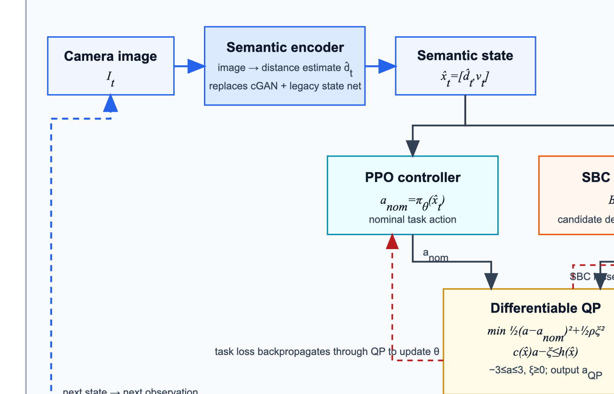
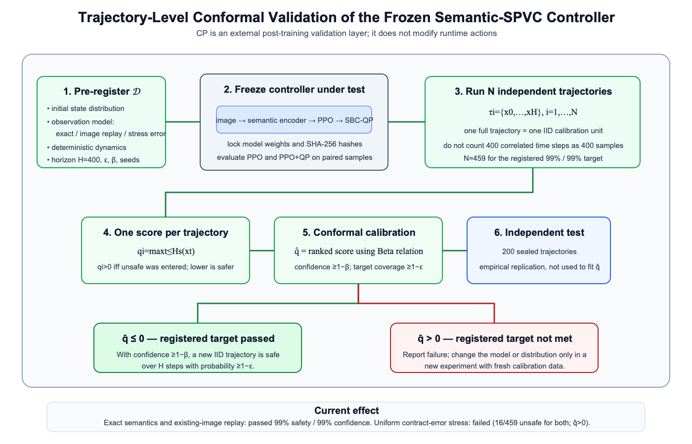

# 语义 SPVC–SBC–QP 框架及其 CP 验证扩展

## ——不带 CP 与带 CP 两个版本的整体架构、原理和实验效果

更新时间：2026-09-28

文档用途：供导师直接阅读。本文不按口头汇报形式展开，而是完整说明当前方法的两个版本、二者关系、实验结果和结论边界。

## 1. 摘要

当前工作基于原 SPVC 的 AEBS 闭环控制任务，形成了两个层次：

1. **不带 CP 的基础版本**：以语义编码器替代原 cGAN 与旧状态网络，PPO 输出名义动作，SBC 网络提供候选风险下降条件，可微 QP 在动作边界内求最终执行动作。该版本负责控制器训练和在线执行。
2. **带 CP 的验证版本**：不改变上述运行时控制链，而是在模型训练完成并冻结后，用独立完整轨迹计算安全违反分数，再通过 conformal prediction 的有限样本秩和 Beta 分布关系，评价冻结控制器在预先登记分布和有限时域内是否达到目标安全率。

基础版本已实现训练、反向传播、保存、重载和闭环运行。早期20起点只用于确认链路跑通；最新正式经验评估将初始区细分为32×32、共1024个固定起点，并分别测试准确语义、真实数据图像最近邻重放、契约内均匀误差、随机边界误差和逐步最坏端点。准确语义与图像重放中PPO、PPO+QP均为1024/1024成功；均匀误差中均有38/1024条unsafe；随机边界中分别有154/1024和155/1024条unsafe；最坏端点中二者均为1024/1024条unsafe。现有QP没有显示额外安全收益。

CP版本已在三种观察分布上完成459条校准轨迹和200条独立测试轨迹：准确语义和已有图像最近邻重放均通过99%安全率/99%置信度目标；语义契约区间内均匀误差压力测试失败，PPO与PPO+QP在校准集中均出现16/459条unsafe轨迹。该失败说明当前系统对大幅距离高估不鲁棒，QP尚未解决这一问题。

## 2. 任务定义与统一符号

AEBS状态写成：

```text
x_t = [d_t, v_t]
```

其中 `d_t` 是车辆到障碍物的真实距离，`v_t` 是速度。每个控制步为0.05秒，动作范围是 `[-3,3]`，在当前动力学定义中正动作表示更强制动。

主要终止条件为：

- success：`5m <= d <= 6m` 且 `v <= 0.5m/s`；
- unsafe：`d <= 6m` 且 `v > 0.5m/s`；
- timeout：400步内没有到达成功或其他终止状态。

400步对应20秒有限时域。本文所有CP结论都只针对这一有限时域。

## 3. 版本A：不带 CP 的语义 PPO–SBC–QP 闭环



可编辑矢量图：[`framework-without-cp.svg`](../../figures/framework-without-cp.svg)

### 3.1 整体数据流

不带CP版本的完整流程是：

```text
图像 I_t
→ 语义编码器得到估计距离 d_hat_t
→ 与速度组成语义状态 x_hat_t=[d_hat_t,v_t]
→ PPO输出名义动作 a_nom
→ SBC根据语义状态生成一步下降条件
→ 可微QP求最终动作 a_QP
→ AEBS动力学产生真实下一状态 x_(t+1)
→ 下一状态产生下一次观察，形成闭环
```

它同时包含感知、任务控制、安全条件、动作优化和动力学五个部分。

### 3.2 语义编码器原理

原SPVC使用较长的“状态→cGAN生成图像→旧状态网络恢复状态”链。当前版本移除cGAN和旧 `state_net`，使用语义编码器直接把输入图像映射为归一化距离及图像相关的不确定度尺度。

控制器实际使用：

```text
x_hat_t = [d_hat_t, v_t]
```

其中距离由图像估计，速度作为独立状态量输入。这样可以明确区分：

- 感知误差：`d_hat_t-d_t`；
- 过程扰动：执行动作后动力学状态本身的额外偏差。

二者不再被混成同一种误差。

### 3.3 PPO原理

PPO网络根据语义状态输出名义动作：

```text
a_nom = pi_theta(x_hat_t)
```

该动作主要负责完成制动任务。原控制器最初由PPO强化学习得到；当前SBC-QP阶段使用原SPVC式控制器损失微调动作网络，并非每一轮都重新执行完整的PPO采样和优势估计。

### 3.4 SBC原理

SBC网络输出一个状态评分：

```text
B_phi(x_hat_t)
```

理想目标是：

- 初始区域的评分较低；
- 不安全区域的评分较高；
- 在闭环动力学和假定扰动下，下一步期望评分不高于当前评分。

一步条件写成：

```text
E_w[B_phi(F(x_hat_t,a,w))] - B_phi(x_hat_t) <= 0
```

这里的SBC只是候选证书。只有区域值、下降条件、扰动假设和验证过程全部成立，它才可能支持安全结论。一个网络被命名为 `sbc.pt` 并不表示安全已经自动得到证明。

### 3.5 可微QP原理

神经SBC条件对动作通常是非线性的。当前实现在PPO名义动作附近进行一阶线性化：

```text
c(x_hat_t)*a <= h(x_hat_t)
```

然后求解一维软约束QP：

```text
minimize    0.5*(a-a_nom)^2 + 0.5*rho*xi^2

subject to  c(x_hat_t)*a - xi <= h(x_hat_t)
            -3 <= a <= 3
            xi >= 0
```

其中：

- 第一项使最终动作尽量接近PPO名义动作；
- `xi` 是slack，即约束放宽量；
- `rho` 是slack惩罚；
- QP输出的 `a_QP` 是环境实际执行动作。

该一维QP具有分段可微的精确解，因此控制器损失可以经过QP反向传播到PPO参数。训练采用交替方式：先更新SBC，再通过QP更新控制器。

### 3.6 不带CP版本已经取得的效果

早期直接使用语义SPVC续训权重时，PPO和PPO+QP均为20/20 unsafe。定位后发现，原控制器学习率 `0.05` 会迅速破坏已有PPO能力。

最小修复为：

- 从原预训练PPO重新初始化控制器；
- SBC从已有检查点继续；
- 控制器学习率降为 `0.0001`；
- 在原100×100状态网格上完成SBC 10轮、控制器1轮训练。

早期链路诊断结果：

| 指标 | PPO | PPO+QP |
| --- | ---: | ---: |
| 固定起点回合 | 20 | 20 |
| success | 20/20 | 20/20 |
| unsafe | 0/20 | 0/20 |
| 平均步数 | 约87.1 | 86.55 |
| QP额外动作干预率 | 0 | 4.16% |
| 正slack率 | 0 | 35.07% |
| 最大slack | 0 | 5.512706 |

因此可以确认：

- 完整工程链路已经跑通；
- QP确实会修改一小部分动作；
- 降低学习率以后保留了原PPO控制能力。

但不能据此确认：

- QP比PPO更安全，因为PPO本身已经20/20成功；
- QP满足硬约束，因为约35%的执行步使用了正slack；
- 原代码的 `0/10000` 是连续域证明，因为原区间上界调用和检查区域均存在已确认限制。

上述20个起点只用于快速诊断。2026-09-28进一步完成了**不使用CP判定**的固定网格全面经验评估：将原初始区域 `d∈[15,16]m、v∈[2.5,3]m/s` 均匀划分为32×32个网格，取每格中心，共1024个起点；每种模式中PPO与PPO+QP使用相同起点和相同的预采样误差序列，每条轨迹最多400步。

| 观测模式 | PPO success / unsafe | PPO+QP success / unsafe | QP干预率 | QP正slack率 |
| --- | ---: | ---: | ---: | ---: |
| 准确语义 `exact` | 1024 / 0 | 1024 / 0 | 4.23% | 35.02% |
| 真实数据图像最近邻重放 | 1024 / 0 | 1024 / 0 | 4.55% | 32.09% |
| 契约内均匀误差 | 986 / 38 | 986 / 38 | 2.90% | 34.17% |
| 每步随机选择契约边界 | 870 / 154 | 869 / 155 | 2.70% | 33.56% |
| 每步选择制动最弱的契约端点 | 0 / 1024 | 0 / 1024 | 6.93% | 64.74% |

五种模式合计每个控制器5120条轨迹。PPO为3904条成功、1216条unsafe；PPO+QP为3903条成功、1217条unsafe。这个合计仅是五组人为测试等权相加的描述统计，不代表真实道路中的事故率。

新的结果把结论从“20个普通起点上没有变差”推进为：

- 当前PPO在准确语义和有限真实图像重放下具有稳定的经验表现；
- 语义误差靠近契约边界时，失败率明显上升；
- 现有QP只在约2.7%–6.9%的步骤改变动作，且约32%–65%的步骤使用正slack；
- QP在均匀误差下没有改变unsafe数，在随机边界下反而多1条unsafe，在最坏端点下也没有挽救任何轨迹，因此**没有证据支持“当前QP提高了鲁棒安全性”**。

结果文件为 `artical-F122/results/semantic_spvc_no_cp_comprehensive_20260928/`。这仍是有限网格、有限时域的经验评估，不是CP结论，也不是连续状态空间证书。

### 3.7 不带CP版本当前的核心问题

当前SBC训练域、原验证域和QP作用域不一致。原验证器仅在一条较窄的SBC值带中检查下降，而QP在整条轨迹上都施加下降条件。因此很多实际状态中，QP面对的是SBC从未被充分训练或验证的条件，这也是正slack较高的重要原因。

## 4. 版本B：带 trajectory-level CP 的冻结闭环验证



可编辑矢量图：[`framework-with-cp.svg`](../../figures/framework-with-cp.svg)

### 4.1 CP在整体框架中的位置

当前CP不是运行时控制器，也不是新的safety filter。它不插在PPO、QP和环境之间，而是在不带CP版本训练完成后：

```text
冻结语义编码器、PPO、SBC和QP
→ 按预先登记分布运行大量完整闭环轨迹
→ 每条轨迹计算一个最大安全违反分数
→ 用conformal排序规则计算q_hat
→ 判断预定安全率与置信度目标是否达到
```

所以带CP版本是在版本A外部增加统计验证层，不是用CP替换SBC或QP。

### 4.2 预登记与模型冻结

在开始生成校准轨迹以前固定：

- 初始距离与速度分布；
- 观察模式；
- 动力学与时域；
- PPO或PPO+QP模型文件及SHA-256哈希；
- 校准和测试样本数；
- 随机种子；
- 目标违反率 `epsilon`；
- 置信失败概率 `beta`。

程序先写 `config.json`，并拒绝覆盖非空结果目录。这避免了根据结果反复改变设置、只保留有利实验。

### 4.3 为什么一整条轨迹才是一个校准样本

同一条轨迹中相邻时间步高度相关，不能把400个时间步当成400个独立样本。当前定义：

```text
tau_i = {x_0,...,x_H}
```

每条独立初始化的完整轨迹是一个校准单位。

### 4.4 轨迹安全分数

单步连续分数基于AEBS unsafe集合：

```text
s(x_t) = min((6-d_t)/1m, (v_t-0.5)/1mps)
```

并对 `d=6m、v>0.5m/s` 的闭边界作数值修正。整条轨迹分数为：

```text
q_i = max_(t<=H) s(x_t)
```

因此：

- `q_i>0` 等价于轨迹曾进入配置的unsafe集合；
- `q_i<=0` 表示轨迹在H步内未进入unsafe集合；
- 分数越小，离unsafe边界越远。

### 4.5 Conformal校准原理

将N个校准分数从最大到最小排序。参考CP-NCBF使用的Beta分布关系，对第 `l` 个最坏分数可计算覆盖率达到 `1-epsilon` 的置信度。

本实验预先设定：

```text
epsilon = 0.01
beta    = 0.01
```

目标含义是：至少99%的未来同分布轨迹满足阈值，且该覆盖结论的置信度至少99%。在采用最坏分数秩 `l=1` 时，需要459条校准轨迹，实际置信度下界为99.0079%。

得到阈值 `q_hat` 后：

- `q_hat<=0`：登记的有限时域安全目标通过；
- `q_hat>0`：目标未达到，必须报告失败。

另外保留200条独立测试轨迹作经验复核，但它们不参与 `q_hat` 拟合。

### 4.6 三种观察分布

当前分别对三种分布重新校准，不能跨分布复用结论。

#### 准确语义

控制器直接读取模拟器真实距离和速度，随机性只来自初始状态。它用于检查控制策略本身。

#### 已有图像最近邻重放

每个控制步根据真实距离，从400张已有图像中选择标签距离最近的一张，实际运行语义编码器，再将预测距离与准确速度输入控制器。它比准确语义更接近完整感知闭环，但会复用固定图像，不代表新摄像头数据。

#### 语义契约区间均匀压力

根据真实距离所在分箱读取语义误差半径，并在整个正负区间内独立均匀采样。该分布会频繁产生最坏半径附近的误差，是强压力测试，不是相机误差的经验频率模型。

### 4.7 带CP版本的实验效果

| 观察模式 | 控制器 | 校准 success/unsafe | 测试 success/unsafe | `q_hat` | 99%/99%目标 |
| --- | --- | ---: | ---: | ---: | --- |
| 准确语义 | PPO | 459/0 | 200/0 | `-0.076305` | 通过 |
| 准确语义 | PPO+QP | 459/0 | 200/0 | `-0.073926` | 通过 |
| 图像最近邻重放 | PPO | 459/0 | 200/0 | `-0.077555` | 通过 |
| 图像最近邻重放 | PPO+QP | 459/0 | 200/0 | `-0.083474` | 通过 |
| 区间均匀压力 | PPO | 443/16 | 194/6 | `+0.024503` | 失败 |
| 区间均匀压力 | PPO+QP | 443/16 | 192/8 | `+0.025823` | 失败 |

图像重放中的平均绝对距离误差约0.08m。最大误差约2.79m，但主要异常是把障碍物估计得更近，导致更早制动，没有造成unsafe。

压力测试失败与一个异常语义样本有关：真实距离8.467m被预测成5.692m，误差为-2.776m。这个样本把 `7.75–10.5m` 分箱的契约半径扩大到2.776m；压力分布又把同样幅度对称地解释成可能出现正向高估，因此频繁产生原数据中未观察到的大幅距离高估。

### 4.8 带CP版本能够支持的结论

准确表述为：

> 在预先登记的初始状态分布、观察模式、确定性动力学和400步范围内，如果 `q_hat<=0`，则以至少99.0079%的置信度，新同分布轨迹在20秒内不进入配置unsafe集合的概率至少为99%。

该结论不能外推到：

- 其他初始状态分布；
- 新相机、光照、视角或障碍物；
- 未登记的过程扰动；
- 分布外压力；
- 无限时域；
- 连续全状态空间的确定性安全。

## 5. 两个版本的关系与区别

| 对比项    | 不带CP版本              | 带CP版本                       |
| ------ | ------------------- | --------------------------- |
| 主要目标   | 学习并执行控制动作           | 验证冻结控制器的分布相关有限时域可靠性         |
| 核心模块   | 语义编码器、PPO、SBC、QP、环境 | 左侧完整闭环，加轨迹采样、评分和conformal校准 |
| 是否在线运行 | 是，每个控制步都运行          | 当前否，属于训练后离线验证               |
| 是否修改动作 | PPO与QP共同决定动作        | CP不修改动作                     |
| 是否更新网络 | 训练阶段更新PPO和SBC       | 第一版CP冻结全部网络                 |
| 主要输出   | 最终动作、回合结果、slack和干预率 | `q_hat`、置信度、CP通过/失败、独立测试结果  |
| 证据类型   | 工程可运行性和有限仿真表现       | 有限样本、分布相关的概率结论              |
| 主要问题   | 正slack高、QP安全增益未证明   | 依赖校准分布，不能覆盖分布外或无限时域         |

二者不是竞争关系：

- 没有版本A，就没有可被验证的闭环控制器；
- 只有版本A的有限rollout，不能形成高置信统计声明；
- 版本B可以发现失败，但不会自动修复控制器；
- 控制器改动或分布变化以后，版本B必须重新校准。

## 6. 当前工作的主要贡献与诚实定位

### 已完成

1. 用语义编码器完成对原cGAN与旧状态网络的受控替换。
2. 实现AEBS一维动作的可微软约束SBC-QP层。
3. 跑通SBC与控制器交替训练、梯度传播、保存和重载。
4. 找到大控制器学习率破坏原PPO能力的问题，并用原PPO初始化及 `1e-4` 学习率修复。
5. 建立PPO与PPO+QP的配对闭环评价。
6. 实现以完整轨迹为校准单位的CP工具，并保存模型哈希、配置及逐轨迹数据。
7. 完成准确语义、图像重放和强误差压力三层实验。

### 尚未完成

1. 尚未证明QP相对PPO有显著安全收益。
2. 尚未消除约32%–35%的正slack。
3. 尚未使SBC训练域、QP作用域和验证域完全一致。
4. 图像重放复用已有400张图像，尚未验证新图像泛化。
5. trajectory-level CP验证的是最终轨迹事件，尚未直接校准SBC各项数学条件。

## 7. 下一步建议

最值得推进的不是继续增加相同训练轮数，而是实现离散CP-SBC margin-retraining：

1. 分别定义初始区、不安全区和一步下降的违反分数；
2. 用独立状态/轨迹校准各分数；
3. 通过CP阈值得到应增加的训练裕量；
4. 重新训练SBC，并使用新校准集复查；
5. 检查QP正slack是否下降、任务成功率是否保留；
6. 若仍无法满足，则停止把当前SBC-QP解释为硬安全层，保留trajectory-level CP作为冻结控制器评价方法。

同时，为增强视觉结论，应收集与训练数据分离的新图像轨迹，重新进行整轨迹CP校准，而不是继续重复现有400张图像。

## 8. 最终结论

不带CP版本已经形成完整的语义感知、PPO控制、SBC约束和可微QP执行闭环，能够训练和运行；但其安全层仍存在大量正slack，且没有证明比原PPO更安全。

带CP版本为冻结后的同一闭环增加了有限样本统计验证。它在准确语义和已有图像重放分布下通过99%安全率/99%置信度目标，在强区间误差压力下失败。这一结果既给出了当前系统的有效范围，也明确暴露了对大幅距离高估不鲁棒的问题。

因此，当前工作的合理定位不是“已经获得绝对安全系统”，而是：**完成了一条从语义感知、可微安全控制到轨迹级概率校准的可运行研究框架，并用通过与失败实验明确划定了它的适用边界。**

## 9. 主要参考资料

- [原SafePVC论文](../references/720_file_Paper.pdf)
- [BarrierNet：可微CBF-QP安全层](../references/BarrierNet_Differentiable_Control_Barrier_Functions_for_Learning_of_Safe_Robot_Control.pdf)
- [Opt-ODENet：可微优化层与控制器联合学习](../references/Opt-ODENet.pdf)
- [CP-NCBF：基于Conformal Prediction的神经屏障函数校准](../references/2503.17395v2.pdf)
