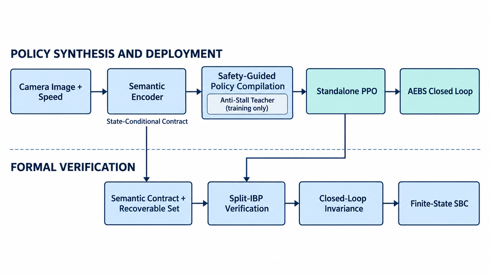

# SafePVC 论文改进工作完整汇报

> 更新日期：2026-09-17
>
> 实验对象：AEBS（自动紧急制动）视觉闭环控制
>
> 最终策略：`results/mvp/14_standalone_ppo_dual_boundary_repair/standalone_ppo_repaired.zip`
>
> 连续域验证：`results/mvp/16_policy_ibp_full_final/metrics.json`
>
> 补充SBC：`results/mvp/17_finite_state_sbc/metrics.json`

## 一、项目总结论

本项目不只完成了standalone PPO。整体工作包括：**分析原SafePVC论文与代码、复现AEBS baseline、训练语义感知模型、构造状态相关conformal契约、训练robust controller、拆分感知和过程不确定性、实现和诊断多种neural SBC、开发safety filter与anti-stall教师、将教师行为编译到无filter PPO、开发反例定向修复、建立物理可恢复集、完成连续域IBP形式验证，以及最终用LP求解有限状态supermartingale barrier。**

最终控制器是一个**部署时不调用 safety filter 的 standalone PPO**：它在 exact、uniform、random-boundary 和 worst-endpoint 四种感知误差模式下均达到 **100% success、0% unsafe、0% timeout**。随后通过物理停车距离定义可恢复集，并用自适应 split-IBP 对连续状态和连续感知误差进行验证，最终在完整 `d∈[5,16]m、v∈[0.5,3]m/s` 域上得到：

- `status = local_action_condition_verified`；
- evaluated cells = 3624；
- certified cells = 2002；
- unresolved cells = 0；
- 可恢复且已证成面积 = 85.53%；
- 物理不可恢复面积 = 14.47%；
- 未决面积 = 0%。

这意味着：**在当前离散动力学正确、过程残差为零、且每步感知误差位于已校准语义契约内的条件下，该无 filter PPO 能保持可恢复集一步闭包，从而由归纳法得到闭环安全结论。**

在此基础上，result 17的有限状态SBC返回 `verified`，得到 `B(R)=0, B(T)=0, B(U)=1`、条件失败上界 `beta=0`和零LP约束残差。

## 二、为什么要改原方法

原 SafePVC 的主要思路是：用 cGAN 或其代理模型生成视觉观测，训练 PPO 控制器，再学习随机屏障证书（SBC）对视觉闭环给出概率安全下界。当前代码和论文思路中有几个需要改善的问题：

1. **感知链条过长。** 先生成图像、再压缩图像会引入多层近似误差，但控制真正需要的只是障碍物距离等低维语义量。
2. **感知误差和过程扰动混在一起。** 感知误差改变控制动作，不等于车辆动力学本身存在独立扰动；若两者重复计算，证书会过度保守。
3. **控制器训练与验证条件不一致。** 在精确语义上训练，却在最坏感知区间上验证，会出现 train–verification mismatch。
4. **自由神经 SBC 难以同时满足区域值和全域下降条件。** 在临近终止区、安全区和物理不可恢复区时，任意形状的 neural barrier 容易学到互相冲突的约束。
5. **仅有仿真成功率不够。** 有限回合没出事，不等于所有连续状态和感知误差都安全。

因此，工作主线逐步转向：

> 真实图像→语义距离及其误差契约→离线安全教师→无filter PPO→反例定向修复→物理可恢复集→连续区间形式验证。

### 2.1 对原工程和论文做了什么检查

项目开始时并没有直接调参，而是先完成了以下检查：

- 阅读 `720_file_Paper.pdf`，拆解原SafePVC的observation model、PPO、SBC、counterexample refinement和概率保证链条；
- 检查AEBS环境、状态网络、PPO checkpoint、barrier训练和verifier之间的数据接口；
- 确认训练与验证使用的扰动语义不完全一致，且感知误差曾被再次当作状态转移扰动；
- 检查硬编码Lipschitz/扰动项、初始集、unsafe集、终止状态和验证域的口径；
- 复现原AEBS基线闭环，并统一所有后续实验的终局分类和metrics文件。

这些工作决定了后续不能只问“某个loss能否降低”，而必须保证感知、控制、动力学和证书的变量定义一致。

### 2.2 阅读本汇报前需要理解的术语

为避免只看懂实验数字、却不明白实验实际检查了什么，本节先用自动刹车例子解释后文最常出现的概念。更完整的零基础解释见《实验通俗进展.md》。

#### 四种感知测试模式

假设真实距离为10m，语义契约允许控制器看到9.6m到10.4m之间的距离：

| 模式 | 实际输入方式 | 通俗解释 |
|---|---|---|
| exact | 直接输入真实距离10m | 假设摄像头完全准确 |
| uniform | 每一步在9.6m到10.4m之间均匀随机取值 | 模拟普通随机感知误差 |
| random-boundary | 每一步随机选择9.6m或10.4m | 每次都错到契约边界，但偏大或偏小随机 |
| worst-endpoint | 同时计算两个端点，选择PPO刹车更小的动作 | 每一步选择两个契约端点中对安全更不利的一个 |

worst-endpoint只表示当前两个契约端点中的局部最坏输入，不代表现实世界全部因素的绝对最坏情况。

#### 感知、误差和控制术语

| 术语 | 通俗解释 |
|---|---|
| 语义 semantic | 从图像中提取的、对控制直接有用且人可以理解的信息；本项目是障碍物距离 |
| semantic encoder | 将摄像头图像转换成距离估计的网络 |
| 感知误差 | 估计距离与真实距离的差，例如真实10m但估计10.3m |
| 连续感知误差 | 感知值可以取误差区间内任意实数，不是只取几个预设点 |
| calibration set | 不参与模型训练，专门用于测量误差范围的数据 |
| conformal prediction | 根据校准误差为新样本构造预测区间的方法 |
| semantic contract | 后续控制和验证必须完整考虑的感知误差范围 |
| state-conditional | 不同真实距离使用不同误差半径 |
| coverage | 测试样本中真实答案落入预测区间的比例；当前97.5%是单帧测试coverage |
| controller / policy | 根据距离和速度输出刹车动作的程序 |
| PPO | 本项目控制器使用的强化学习算法 |
| safety filter | PPO刹车不足时将动作提高到最低安全刹车的保护层 |
| anti-stall | 防止filter刹车过强，导致车辆虽然不撞车却长期停滞 |
| teacher / student | filter作为教师生成安全动作，PPO作为学生模仿这些动作 |
| distillation | 用teacher动作训练student的过程 |
| retention | 修复新反例时保留原策略已经学会的行为，避免遗忘 |
| standalone PPO | 部署时可以独立运行、不再调用safety filter的PPO |
| rollout | 车辆从初始状态一直运行到成功、危险或超时的一条完整轨迹 |
| counterexample | 验证器找到的、确实不满足安全动作要求的状态和感知输入 |

#### 物理安全与验证术语

| 术语 | 通俗解释 |
|---|---|
| dynamics | 根据当前距离、速度和刹车动作计算下一状态的车辆运动公式 |
| process disturbance | 路面、制动能力和未建模阻力等对车辆真实转移的额外影响 |
| process residual | 实际下一状态减去动力学公式预测的下一状态 |
| double counting | 同一个感知误差既通过PPO动作计算一次，又被当作process noise再计算一次 |
| stopping distance | 从当前速度降到安全目标速度所需的前进距离 |
| recoverable set | 立即使用最大允许刹车时仍来得及安全减速的状态集合 |
| unrecoverable set | 即使最大刹车也无法保证挽回的状态集合 |
| invariant / closure | 当前在可恢复集内，一步后仍在可恢复集内或进入安全终止集 |
| grid / cell | 将连续的距离和速度平面分成小矩形；cell代表整个小区域而非单点 |
| sampled diagnostic | 在有限采样点上找反例，没找到也不能当作连续证明 |
| IBP | 区间界传播，计算整个连续输入区间对应的神经网络输出上下界 |
| split-IBP | 将过大的感知区间和状态cell不断切小，再分别用IBP计算更紧的界 |
| sound bound | 可能偏保守，但保证覆盖指定区间内全部真实网络输出的界 |
| certified cell | 已证明整个cell都满足安全动作条件 |
| unresolved cell | 当前数值界还不能判断的cell，不一定真的不安全 |
| margin | PPO动作下界减去物理所需刹车；正数表示通过，负数表示违反 |

#### SBC和结果指标术语

| 术语 | 通俗解释 |
|---|---|
| barrier function | 给状态分配危险分数的函数；安全初始区低、危险区高 |
| SBC | Stochastic Barrier Certificate，用barrier条件表达不确定系统安全性的证书 |
| neural SBC | 使用神经网络表示并训练的barrier |
| decrease condition | 下一步barrier分数不能高于当前分数，或必须至少下降epsilon |
| violation | 某个状态不满足证书条件 |
| LP | 线性规划，在一组线性不等式下求解变量 |
| supermartingale | 下一步期望值不高于当前值的过程 |
| beta | 在证书假设成立时，从初始集到达危险抽象状态的上界 |
| MAE / RMSE | 两种平均误差指标；RMSE对少数较大误差更敏感 |
| success / unsafe / timeout | 成功完成任务、进入危险区、运行到400步仍未结束 |
| return | 一个完整回合中所有奖励的总和 |
| certified area | 已证cell占状态矩形的面积比例，不是安全概率 |

#### 五个原始问题的白话解释

1. **感知链条过长：** 原方法先生成模拟图像，再由另一个模型处理图像。每多经过一个学习模型就多一层误差，而AEBS真正需要的主要信息只是障碍物距离。
2. **感知误差和过程扰动混用：** “摄像头把距离看错”会先改变PPO动作；“车辆真实运动与公式不同”才属于过程残差。若把前者造成的状态变化再次当作过程噪声，同一个误差会被计算两次。
3. **训练与验证条件不一致：** 相当于驾驶员只在摄像头完全准确时练习，考试时却要求他在最大距离误差下也安全。简单混入误差重新训练PPO并没有解决问题，因此后来改用明确的安全teacher标签。
4. **自由neural SBC约束冲突：** barrier既要让初始区低分、危险区高分，又要求普通状态每一步下降；但安全终止区不应继续强制下降，物理不可恢复区也不能假装可挽回，边界附近很容易产生冲突。
5. **仿真成功率不等于连续证明：** 跑很多回合没有事故，只说明被采到的轨迹没出问题。连续状态和感知误差有无穷多种组合；本项目的粗网格曾显示零反例，局部加密后仍找到了窄边界反例。

## 三、最终建成的闭环系统

### 3.1 完整系统架构



上图展示了当前方法从策略训练、实际部署到形式验证的完整架构。上半部分为策略合成与部署流程：首先利用图像数据训练语义编码器，将摄像头图像转换为障碍物距离，并通过校准构造状态相关语义误差契约；随后，使用仅在训练阶段启用的anti-stall safety teacher生成安全动作，再通过策略蒸馏和反例回放将这些行为迁移到standalone PPO中。实际部署时不再使用safety filter，系统仅通过语义编码器和standalone PPO产生制动动作，并与AEBS动力学构成闭环。

下半部分为离线形式验证流程：状态相关语义契约和基于离散停车距离构造的物理可恢复集共同定义验证范围；split-IBP计算PPO在连续感知区间内的保守动作下界，并验证闭环状态始终保持在可恢复集内或进入安全终止集。最后，将该闭环不变性抽象为有限状态SBC，得到契约成立且过程残差为零条件下的安全证书。

这一架构的关键是明确区分三类模块：anti-stall safety teacher只属于离线训练；semantic encoder和standalone PPO属于实际部署闭环；split-IBP、物理可恢复集和有限状态SBC只用于离线验证，不会在车辆运行时增加在线计算开销。

### 3.2 最终部署闭环

最终部署闭环为：

$$
s_t\longrightarrow o_t\longrightarrow E_\phi(o_t)=\hat d_t
\longrightarrow \pi_{14}(\hat d_t,v_t)=a_t
\longrightarrow f(s_t,a_t)=s_{t+1}.
$$

其中：

- $s_t=(d_t,v_t)$ 是真实距离和速度；
- $o_t$ 是视觉图像；
- $E_\phi$ 将图像转成语义距离估计；
- $\pi_{14}$ 是最终 standalone PPO；
- $a_t$ 是制动动作；
- $f$ 是当前离散车辆动力学。

safety filter 仅在训练期作为教师生成标签。最终 rollout、部署和形式验证都只调用 PPO，不在运行时读取 filter JSON。

验证时不把语义距离当成一个精确数，而是使用：

$$
\hat d_t\in\mathcal C_d(s_t),
$$

即对当前真实状态可能对应的所有契约内感知结果一起验证。

## 四、完成的主要工作

### 4.0 全部工作流水总览

| 阶段 | 完成的工作 | 结果/决策 |
|---|---|---|
| 0 | 论文和代码审查、AEBS baseline复现、实验配置与输出统一 | 找到感知/过程扰动混用、证书域和终止口径等问题 |
| 1 | 训练图像→语义距离encoder | MAE=0.1004m，RMSE=0.1934m |
| 2 | global、Mondrian和基于真实状态分箱的conformal契约 | 最终采用状态条件契约，test coverage=97.5% |
| 3 | exact/uniform/endpoint mixture robust PPO fine-tuning | 安全性和return均变差，不采用 |
| 4 | 4×4状态相关不确定性接口 | 发现旧实现将感知效应重复计入process noise |
| 5 | 独立process-residual建模 | 当前确定性simulator的16个cell残差均为0 |
| 6 | neural SBC trainer、网格verifier、反例输出 | 训练链路跑通，但多种变体均未证成 |
| 7 | global/adaptive/anti-stall safety filter | anti-stall在四种误差模式下均100%成功、0%危险 |
| 8 | safety filter→standalone PPO离线蒸馏 | v1全timeout；v2四种模式全通过 |
| 9 | 固定网格LP与teacher→student证书迁移诊断 | 找到边界建模冲突，密集检查发现粗网格遗漏反例 |
| 10 | 高速/低速临界反例局部修复 | 单边界修复会遗忘；联合回放result 14通过 |
| 11 | 离散停车距离和viability domain | 分离可恢复集与物理不可恢复集 |
| 12 | sound split-IBP和自适应state partition | result 16完整域0 unresolved |
| 13 | 有限状态supermartingale barrier LP | result 17 `verified`，`beta=0`，LP残差0 |

下面分阶段说明具体实验。

### 4.1 语义感知模型

将原来复杂的图像生成/代理思路简化为真实图像到障碍物距离的 semantic encoder。

| 指标 | 结果 |
|---|---:|
| MAE | 0.1004 m |
| RMSE | 0.1934 m |
| 最大绝对误差 | 1.2678 m |
| 语义控制动作 MAE | 0.0443 |
| 语义控制动作 RMSE | 0.1162 |

这表明低维语义距离已保留了当前任务所需的主要控制信息。

作为对照，原legacy real-image距离预测的MAE为2.8619m、RMSE为3.4540m，而新semantic point的MAE为0.1004m、RMSE为0.1934m。这不只是模型替换，也大幅减少了后续控制和证书需要处理的输入维度。

### 4.2 状态相关语义误差契约

将距离分成4个区间，用独立 calibration set 校准误差半径。

| 距离区间 | 感知误差半径 |
|---|---:|
| 5.00–7.75 m | 0.0834 m |
| 7.75–10.50 m | 2.7757 m |
| 10.50–13.25 m | 0.1649 m |
| 13.25–16.00 m | 0.4160 m |

- 目标 coverage：95%；
- 测试 coverage：97.5%；
- 平均区间宽度：2.0525 m；
- 中位区间宽度：0.8320 m。

第二个距离区间的半径明显较大，这是当前数据的真实结果，没有为了证明成功而人工缩小。最终 verifier 仍覆盖这些完整误差区间。

同时还实现了两个对照契约：

| 契约 | coverage | 特点与决策 |
|---|---:|---|
| global normalized conformal | 91.25% | 未达95%目标，且远距离分箱coverage降至80% |
| Mondrian normalized conformal | 92.50% | 第一分箱quantile高达27.9975，区间明显不稳定 |
| state-conditional absolute residual | 97.50% | 半径有一个分箱偏宽，但口径清晰且被最终verifier完整纳入 |

### 4.3 robust controller fine-tuning：完成但不采用

为了减小训练和验证的差异，曾使用 `50% exact + 25% contract内uniform + 25% endpoint` 的语义观测混合训练PPO 20,000步，并加入轻量模仿约束。实验完成了，但结果比原controller更差：

| 误差模式 | baseline unsafe | robust unsafe | baseline return | robust return |
|---|---:|---:|---:|---:|
| exact | 0% | 0% | 405.817 | 282.814 |
| uniform | 1% | 21.5% | 405.485 | 280.708 |
| random-boundary | 17% | 28% | 400.651 | 278.523 |
| worst-endpoint | 100% | 100% | 241.775 | 165.364 |

因此没有将该checkpoint当作最终controller。这个负结果说明：仅把最坏感知样本混入PPO训练，不会自动得到安全且高效的策略。

### 4.4 修正闭环评估语义

统一了 success、unsafe、stopped-safe-outside-goal、out-of-domain 和 timeout 五类互斥终局；修正 success 重复奖励和400步后的 truncated 语义。这一步很关键，因为“没撞车但一直停着”不能计作成功。

### 4.5 安全教师与 anti-stall 修正

早期 safety filter 虽能降低撞车，但会在 random-boundary 模式中100% timeout。为此加入 anti-stall 逻辑：保留安全制动，但避免单步过度制动造成长时间停滞。

| 误差模式 | 原 PPO success / unsafe | anti-stall teacher success / unsafe |
|---|---:|---:|
| exact | 100% / 0% | 100% / 0% |
| uniform | 96% / 4% | 100% / 0% |
| random-boundary | 86.5% / 13.5% | 100% / 0% |
| worst-endpoint | 0% / 100% | 100% / 0% |

这一阶段得到了一个“安全且不会停滞”的教师，但它仍然是运行时 filter，不是最终部署方案。

这一结论是通过四个版本的同条件对比得到的：

| 模式 | baseline | global-max filter | observed-bin adaptive | adaptive anti-stall |
|---|---|---|---|---|
| exact | 100% success, 0% unsafe | 100%, 0% | 100%, 0% | **100%, 0%, 0% timeout** |
| uniform | 96% success, 4% unsafe | 75.5% success, 24.5% timeout | 90% success, 10% timeout | **100%, 0%, 0% timeout** |
| random-boundary | 86.5% success, 13.5% unsafe | 0% success, 100% timeout | 0% success, 100% timeout | **100%, 0%, 0% timeout** |
| worst-endpoint | 0% success, 100% unsafe | 100% success, 0% unsafe | 100% success, 0% unsafe | **100%, 0%, 0% timeout** |

global-max和adaptive observed-bin已经能防撞，但“防撞”不等于“完成任务”；random-boundary的100% timeout直接促使我们加入anti-stall逻辑。

### 4.6 把 safety filter 离线编译到 PPO

用 anti-stall teacher 在状态网格和感知误差内生成动作标签，从原 PPO 初始化并训练学生 actor。这里的 filter 只用于离线数据生成；训练结束后只保留 PPO zip。

第一版蒸馏失败：动作 MAE=0.3569，四种模式全部100% timeout。原因是低速区存在轻微过制动，长时闭环积累后车辆无法到达目标。

第二版通过低速临界样本加密、恢复标签和过制动惩罚，将 teacher action MAE 降到0.1057，四种模式均达到100% success、0% unsafe、0% timeout。

该阶段也修正了“epoch到80不动”的误解：早期脚本的日志间隔、early-stop/最优checkpoint选择和actor loss平台会让终端看起来像停了，但核心问题不是简单增加epoch，而是低速标签与长时闭环行为。

### 4.7 区分感知误差与过程扰动

原 `03_uncertainty` 将感知误差导致的动作差异再次当成过程扰动，造成 double counting。修正后单独计算 simulator transition residual。当前模拟器是确定性的，且现有数据不含额外转移残差，因此16个状态cell的process residual box均为0。

这不表示真实世界没有过程噪声，只表示当前实验可以准确支持的范围是“确定性动力学 + 感知契约”。

两个不确定性产物的区别如下：

| 产物 | 定义 | 数值 | 最终处置 |
|---|---|---|---|
| `03_uncertainty` | 控制动作因感知误差变化后的下一状态差 | speed support约 `[-0.1494, 0.1158]` | 不再作为独立process noise，避免double counting |
| `03_process_uncertainty` | simulator预测与实际transition的独立残差 | 16个cell的low/high/radius均为0 | 作为当前确定性MVP的process residual |

### 4.8 完成 neural SBC 实验并明确其失败原因

实现了独立barrier trainer、状态相关扰动接口、区域约束、固定网格verifier和反例输出。先后检查了权重放大、staged training、hard-case max loss、top-k、完整终止域、viability domain、低速curriculum和不同非负输出形式。

重要负结果包括：

- standalone PPO neural SBC：violations=2769/4483，min margin=-0.165517；
- 低速curriculum：violations=2576/4483，epsilon=0 时仍有1379个违反；
- softplus-square：violations=2556/4483，没有实质改善。

主要SBC实验完整流水如下。不同版本的验证域有所修正，因此violation count不能脱离分母直接横向比较；表格的作用是记录每个方向已经真正运行，而不是只做了理论讨论。

| 版本 | 主要改动 | violations | min margin | 结论 |
|---|---|---:|---:|---|
| `04_robust_sbc` | 第一版训练器 | 4170/6400 | -0.529670 | 大量违反，且loss中出现NaN |
| `gridtrain_diag` | 网格状态训练 | 1096/6400 | -1.024010 | 违反数降低，但最坏幅度更大 |
| `unsigned_staged` | 分阶段区域/下降训练 | 2886/6400 | -0.624824 | 不通过 |
| `hardcase_maxloss` | 强化最坏点loss | 4284/6400 | -0.025465 | 最坏值收紧，但全域违反更多 |
| `topk_warmstart` | top-k最坏样本+热启动 | 975/6320 | -1.065387 | 局部减少，仍无证书 |
| `filtered_zero_process` | 修正process residual并用filter controller | 901/6320 | -0.105069 | 区域值与decrease仍冲突 |
| `complete_domain` | 排除terminal/goal/unsafe | 3656/5688 | -0.252854 | 口径更正确，但违反率64.14% |
| `goal_guided` | 增加goal region约束 | 4953/5704 | -0.463302 | goal与unsafe/initial/decrease尺度冲突 |
| `viability_domain` | 使用可恢复域 | 3642/5419 | -0.220436 | 域修正后仍未通过 |
| `terminal_value` | 修正终止集值 | 3655/5419 | -0.053706 | 最坏幅度改善，仍有1950个epsilon=0违反 |
| `low_speed_curriculum` | 低速课程，epsilon=0.001 | 2576/4483 | -0.001793 | 接近0但仍有1379个epsilon=0违反 |
| `softplus_square` | 替换非负输出形式 | 2556/4483 | -0.005527 | 没有解决结构问题 |
| `standalone_ppo` | 切换到无filter PPO | 2769/4483 | -0.165517 | 控制器经验安全，但自由neural SBC仍失败 |

最终判断：失败不是单纯因为训练轮数不够或某个权重太小。根本原因是：

1. 原矩形验证域含有最大制动也无法避免危险的状态；
2. 终止区、unsafe区和下降约束存在边界口径冲突；
3. 任意神经barrier必须同时适配区域值、尺度和一步下降，优化容易收敛到折中解；
4. 当PPO已有清晰的制动物理结构时，再去拟合一个自由barrier反而更困难。

因此 neural SBC 被保留为重要对照和负结果，但不再作为最终证明后端。

此外还实现了一个6400状态的固定网格certificate LP，共80,045条约束。它返回 `infeasible`，但同时报告“具有一步robust unsafe successor的状态数=0”。这个矛盾帮助定位到：unsafe边界插值同时对终止节点施加 `B=0`和unsafe高barrier约束。因此该LP是建模诊断，不是“物理上无安全controller”的证据。

### 4.9 用物理可恢复集替代自由 neural barrier

对二维 AEBS 动力学，可以直接计算最大制动下的离散停车距离 $S_{\mathrm{disc}}$。定义：

$$
\mathcal R=\left\{(d,v):d-6-S_{\mathrm{disc}}(v;0.5,3,0.05)\ge0\right\}.
$$

$\mathcal R$ 中的状态表示：按当前最大制动能力，仍来得及在危险速度阈值之前完成制动。与 rollout 对比后，精确离散口径得到：

- discrete recoverable states = 5419；
- discrete unrecoverable states = 269；
- recoverable but rollout-unsafe = 0；
- 被连续公式过度乐观、但被离散公式正确排除的边界点 = 14。

这将“安全证书”变成一个非常直接的问题：对任意可恢复状态和所有契约内感知输入，PPO的制动是否至少达到“使下一状态仍然可恢复”的最小制动阈值。

### 4.10 从网格采样到连续区间验证

首先在80×80状态网格和每状态33个语义点上进行 go/no-go 诊断：

- 可恢复 operational states = 4483；
- state–observation pairs = 147939；
- teacher/student 均为4483/4483 sampled-pass；
- 最小下一状态可恢复余量 = 0.003987 m。

然而，对 `d=6–8m、v=2–3m/s` 区域加密到201×201状态、每状态129个语义点后，发现初始student有19/18646个反例，最小下一状态余量为-0.022734 m。这说明粗网格100%通过不能代替连续验证。

为此实现了：

- Tanh/Linear 网络的sound interval bound propagation（IBP）；
- 语义距离输入的连续分段；
- 状态cell自适应细分；
- 可恢复、物理不可恢复和未决三类状态的明确分类；
- 每个未决cell的最差动作下界和物理所需动作输出。

从采样诊断到sound verification的迁移链如下：

| 阶段 | 范围/方法 | 结果 | 作用 |
|---|---|---|---|
| result 05 | 4483状态、33语义样本/状态 | teacher和student均0违反，min margin=0.003987m | 说明值得继续局部形式化 |
| dense refinement | `d=[6,8], v=[2,3]`，201×201状态、129语义样本 | 发现student极少量反例，min margin约-0.0226m | 证明粗采样通过不等于连续安全 |
| result 08 | 高速饱和边界修复 | dense sampled violations=0 | 可进入网络输出界验证 |
| result 09 | 普通自适应IBP | certified area=45.46%，unresolved=0.72% | 界过松，需要语义分段 |
| result 10 | 16段continuous semantic split | local region unresolved=0 | 局部连续动作条件证成 |
| result 11/12 | 扩展全域并修正低速物理阈值 | 未决703→627 | 发现低速离散边界问题 |
| result 13 | 只修低速边界 | 未决增到1831，高速反例回归 | 证明局部顺序微调会遗忘 |
| result 14 | 高低速联合边界回放 | 未决248，dense高速违反0 | 确定最终PPO |
| result 15 | semantic split 64 | 未决135 | 不改策略，只收紧sound bound |
| result 16 | semantic split 256，state depth 9 | 未决0 | 完成全可恢复域连续验证 |

### 4.11 用形式反例修复 PPO

形式验证没有简单返回“失败”，而是定位了两类极窄临界带：

1. `d≈6–8m、v≈2–3m/s` 的高速最大制动边界；
2. `d≈6.03–6.10m、v≈0.65–0.8m/s` 的低速离散制动步数切换边界。

修复过程为：

| 版本 | 结果 | 决策 |
|---|---|---|
| standalone PPO v2 | 四类rollout通过，但高速加密有19个反例 | 进行局部修复 |
| result 07 | 反例19→16，仍未达标 | 提高临界raw action target |
| result 08 | 高速加密反例降到0，rollout全通过 | 进入全域IBP |
| result 13 | 低速边界学会，但遗忘高速边界，重新出现17个反例 | 不采用，暴露顺序修复遗忘 |
| result 14 | 同时回放478个低速和78个高速临界状态 | 两类边界同时通过，定为最终PPO |

result 14 的最终闭环结果：

| 误差模式 | success | unsafe | timeout | 平均步数 |
|---|---:|---:|---:|---:|
| exact | 100% | 0% | 0% | 203.27 |
| uniform | 100% | 0% | 0% | 206.06 |
| random-boundary | 100% | 0% | 0% | 201.84 |
| worst-endpoint | 100% | 0% | 0% | 135.45 |

每种模式均运行200回合，合计800回合。评估过程不调用safety filter。

## 五、最终形式验证是怎么做的

### 5.1 需要验证的条件

对每个可恢复状态cell $C_i$，先由语义契约构造PPO可能看到的完整连续输入区间。IBP计算PPO在该区间上的sound动作下界 $a_i^-$，物理动力学计算保持下一状态可恢复所需的保守动作上界 $a_{i,\mathrm{req}}^+$。若：

$$
a_i^-\ge a_{i,\mathrm{req}}^+,
$$

则该cell内任意真实状态、任意契约内感知误差都不会使下一状态离开可恢复集。

### 5.2 为什么不是普通采样

IBP在连续输入盒上逐层传播网络上下界。它给出的是覆盖整个输入区间的保守界，而不是“取很多点，没发现问题”。对于界过松的cell，验证器会自适应细分状态cell和语义输入区间，但始终保持对原连续集合的完整覆盖。

### 5.3 验证收敛过程

| 阶段 | semantic split | max depth | unresolved cells | unresolved area | 最差动作界缺口 |
|---|---:|---:|---:|---:|---:|
| result 11 | 16 | 7 | 703 | 0.009752% | -2.235508 |
| result 12（修正低速边界阈值） | 16 | 7 | 627 | 约0.01% | -0.540819 |
| result 14（联合边界修复后） | 16 | 7 | 248 | 0.003440% | -0.061253 |
| result 15 | 64 | 7 | 135 | 0.001873% | -0.032828 |
| result 16 | 256 | 9 | **0** | **0%** | 无未决cell |

最终 result 16 的数值为：

| 指标 | 结果 |
|---|---:|
| operational domain | `5–16m × 0.5–3m/s` |
| evaluated cells | 3624 |
| certified cells | 2002 |
| unresolved cells | 0 |
| certified area | 85.5347% |
| physically unrecoverable area | 14.4653% |
| unresolved area | 0% |
| semantic splits | 256 |
| maximum state depth | 9 |
| verification runtime | 20.77 s |

## 六、最终安全结论的准确表述

定义离散可恢复集：

$$
\mathcal R=\left\{(d,v)\in[5,16]\times[0.5,3]:
d-6-S_{\mathrm{disc}}(v;0.5,3,0.05)\ge0\right\}.
$$

最终验证证明，对任意 $s\in\mathcal R$ 和任意契约内感知结果 $\xi\in\mathcal C_\xi(s)$：

$$
\pi_{14}(\xi)\ge a_{\min}(s),
$$

因此：

$$
f(s,\pi_{14}(\xi))\in\mathcal R
\quad\text{or enters the safe terminal set}.
$$

由归纳法，若初始状态位于 $\mathcal R$，且后续每一步的感知误差都在当前契约内，则所有非终止后继状态都保持可恢复，闭环不会进入定义的unsafe set。

这一结论依赖以下假设：

1. 初始状态在可恢复集内；
2. 当前二维离散动力学正确；
3. 过程扰动/模型残差为当前实验中的0；
4. 每步感知误差位于state-conditional semantic contract内；
5. 部署使用result 14 checkpoint和相同的动作裁剪。

## 七、本工作取得的主要效果

### 7.1 工程效果

- 建立了图像→语义→PPO→动力学的完整闭环。
- 将safety filter从运行时组件变成纯离线教师。
- 最终部署只需一个普通PPO checkpoint，无需在线求解安全优化问题。
- 统一了数据、配置、checkpoint、metrics和自动摘要输出。
- 验证失败时能输出具体状态、感知端点、动作下界和所需制动，而不只是一个“失败”标志。

### 7.2 实验效果

- 原 PPO 在worst-endpoint中unsafe=100%；最终PPO降到0%。
- 原 PPO 在random-boundary中unsafe=13.5%；最终PPO降到0%。
- 最终PPO在800个正式评估回合中取得800次success、0次unsafe、0次timeout。
- 密集高速临界诊断覆盖2,405,334个state–observation pairs，最终student violations=0。
- 全域sound IBP最终unresolved=0。

### 7.3 方法上的改进

1. **语义抽象：** 用控制相关的距离替代高维图像生成链。
2. **感知契约：** 对语义估计使用状态相关conformal区间，而不是只用点估计。
3. **不确定性解耦：** 区分perception error和process residual，消除double counting。
4. **安全策略编译：** filter只当离线教师，最终得到无filter学生策略。
5. **证书余量定向修复：** 只修复形式反例所在的窄边界，而不重新全局调参。
6. **物理证书：** 用离散停车距离定义可恢复集，避免训练一个任意形状的barrier。
7. **连续区间验证：** 用sound IBP和自适应分割从有限采样通过提升到连续集合条件验证。

## 八、失败实验带来的明确结论

本项目不只有最终成功结果，也通过失败实验排除了几条低成功率路线：

- **不再单纯增大barrier loss权重。** weight=100并没有得到证书。
- **不再反复改barrier输出形式。** softplus、square和curriculum都没解决全域下降冲突。
- **不把固定网格100%通过当成形式证明。** 加密后确实找到了粗网格遗漏的student反例。
- **不进行只修新区域的顺序微调。** result 13证明它会遗忘之前的高速临界；必须使用联合临界回放。
- **不把感知动作差再当作process noise。** 两类误差必须分开。
- **不对物理不可恢复区强行要求证书。** 这些状态不是训练失败，而是任何策略都无法克服的物理限制。

## 九、论文可以怎样讲这项工作

建议论文主线不再表述为“重新训练了一个更好的SBC”，而是：

> **Perception-aware safety-filter compilation with physics-guided continuous verification**：用安全过滤器作为离线教师，将安全行为编译到无运行时filter的神经策略，再结合状态相关语义契约、物理可恢复集和sound网络输出界证明其条件安全性。

可以整理为以下贡献：

1. 一个部署时不调用filter的安全策略编译流程；
2. 将状态相关感知契约直接接入学生策略连续输出验证；
3. 基于证书余量的局部反例修复和联合边界回放；
4. 使用物理可恢复集与sound split-IBP得到无未决cell的连续域条件证书；
5. 一组完整的负结果，说明为何在该AEBS任务中直接训练自由neural SBC不如利用物理结构验证有效。

这些贡献是一个有潜力的组合，但正式投稿时不应在没有完成更广泛文献检索和额外实验前使用“首次”等绝对措辞。

## 十、补充SBC结果与还没有完成的问题

### 10.0 补充的有限状态SBC已正式运行并通过

前面失败的是“任意神经网络 + 全域严格递减”的neural SBC，而不是所有barrier形式都不可行。现在已新增一个最简的有限状态supermartingale barrier LP：将连续状态分成可恢复 `R`、安全终止 `T`和危险/不可恢复 `U`，直接使用result 16已证成的 `R -> {R,T}` 闭包关系。线性规划求解非增barrier，避免了之前终止集与严格递减的冲突。

它的作用是补上SBC表达并作为算法对照；主要连续安全证据仍然是result 16的sound IBP。正式线性规划已获得HiGHS最优解：

| 指标 | 正式结果 |
|---|---:|
| status | `verified` |
| result 16 closure | evaluated=3624, certified=2002, unresolved=0 |
| initial recoverability margin | 7.47 m |
| barrier | `B(R)=0, B(T)=0, B(U)=1` |
| conditional failure bound | `beta=0` |
| maximum LP residual | 0 |
| runtime | 0.273 s |

这表明，从初始集出发，在result 16所验证的抽象转移下，闭环不会从可恢复集进入危险/不可恢复集。这里的 `beta=0` 是contract内且零过程残差条件下的上界，不能替代轨迹级概率校准。

### 10.1 轨迹级概率安全还没有建立

当前97.5%是语义契约在有限测试样本上的coverage，不是整条轨迹的安全概率。闭环中误差随状态和历史变化，不能简单假设每步独立，也不能直接把单步coverage写成整轨迹coverage。

后续需要收集独立闭环轨迹，选择有限时域联合校准、trajectory-level conformal calibration或有效的风险预算方法。

### 10.2 过程扰动仍是零残差假设

当前数据不支持建立真实车辆动力学残差分布。若要扩展到非确定性动力学，需要真实或更高保真转移数据，再构建有可靠置信的状态相关扰动集。

### 10.3 实验规模仍是MVP

当前主实验使用单一AEBS benchmark、固定seed 7和有限感知数据。这足以证明方法链条可运行并得到一个完整条件证书，但正式投稿通常还需要更多数据条件、至少一个额外任务或更系统的消融实验。这些属于后续论文完整化，不需要推翻当前最终PPO和verifier。

### 10.4 语义契约中第二距离分箱偏宽

`7.75–10.5m` 区间的半径为2.7757m，说明该区间数据较少或感知性能不稳定。最终安全验证已经包含这一宽契约，所以不影响当前条件证书的保守性；但如果要提高控制性能或缩小区间，应增加该距离段的感知数据。

## 十一、给导师汇报时的建议说法

可以按以下逻辑口头汇报：

1. 我们先复现并检查了原SafePVC链路，发现感知、过程扰动和证书条件有混用和不一致。
2. 我们把图像转成低维语义距离，用conformal calibration给出状态相关误差契约。
3. 一个简单safety filter虽然安全，却会让车长时停住；加入anti-stall后才同时解决安全和任务完成。
4. 这个filter只用来当离线教师，我们最终得到了一个运行时不需要filter的PPO，四种最坏感知测试都是100%成功、0%危险。
5. 我们确实尝试了多种neural SBC，但它们没有被强行包装成成功。分析后发现使用车辆制动的物理可恢复集更直接、也更容易验证。
6. 验证器在粗网格通过后又找到了极窄的高速和低速反例。我们只修这些临界区，并用联合回放避免遗忘。
7. 最终在完整连续域和完整感知契约上得到0个未决cell。因此无filter PPO在契约内的条件安全性已经证明。
8. 剩余的不是继续调PPO或调验证器，而是用独立轨迹数据把单步感知coverage升级为整轨迹风险结论。

## 十二、最终产物和复现位置

| 产物 | 路径 |
|---|---|
| MVP统一配置/入口/摘要 | `artical-F122/Aebs/mvp/config.json`、`run.py`、`report.py` |
| 语义encoder与契约 | `artical-F122/results/mvp/01_semantic/` |
| robust controller负结果 | `artical-F122/results/mvp/02_controller/` |
| safety filter比较 | `artical-F122/results/mvp/02_safety_filter_anti_stall_compare/` |
| process residual | `artical-F122/results/mvp/03_process_uncertainty/` |
| neural SBC实验系列 | `artical-F122/results/mvp/04_robust_sbc*/` |
| 证书迁移与局部修复 | `artical-F122/results/mvp/05_*`至`15_*` |
| 最终standalone PPO | `artical-F122/results/mvp/14_standalone_ppo_dual_boundary_repair/standalone_ppo_repaired.zip` |
| 最终PPO评估 | `artical-F122/results/mvp/14_standalone_ppo_dual_boundary_repair/metrics.json` |
| 最终全域IBP验证 | `artical-F122/results/mvp/16_policy_ibp_full_final/metrics.json` |
| 最终verifier入口 | `artical-F122/Aebs/mvp/verify_policy_ibp_full_final.py` |
| 有限状态SBC入口 | `artical-F122/Aebs/mvp/finite_state_sbc.py` |
| 有限状态SBC输出 | `artical-F122/results/mvp/17_finite_state_sbc/` |
| 完整实验流水与命令 | `改进实验记录.md` |
| 零基础术语和实验进展解释 | `实验通俗进展.md` |
| 导师汇报PPT逐页提纲 | `导师汇报PPT逐页内容.md` |
| 投稿方向调研 | `可投稿创新方向调研报告.md` |

最终验证复现命令：

```bash
cd /root/work_based_on_spvc/artical-F122

/opt/miniconda3/bin/conda run --no-capture-output -n vt \
  python -m Aebs.mvp.verify_policy_ibp_full_final
```

补充SBC运行命令：

```bash
cd /root/work_based_on_spvc/artical-F122

/opt/miniconda3/bin/conda run --no-capture-output -n vt \
  python -m Aebs.mvp.finite_state_sbc
```

## 十三、最终总结

本项目没有简单地“把原SBC调到通过”，而是通过一系列可复现实验确认了原路线的结构性问题，并建立了一条更适合当前AEBS系统的新路线：

1. 审查并复现原SafePVC/AEBS工程，统一训练、评估和验证口径；
2. 训练语义encoder，将距离MAE从legacy方案的2.8619m降至0.1004m；
3. 实现并比较global、Mondrian和state-conditional conformal契约；
4. 完成robust controller fine-tuning，根据负结果明确否定简单mixture训练；
5. 分离感知误差与process residual，消除double counting；
6. 实现并运行多种neural SBC、网格LP和域诊断，完整保留失败原因；
7. 开发global、adaptive和anti-stall safety filter，得到既安全又能完成任务的离线教师；
8. 将安全行为编译到无filter PPO，并使用形式反例精确修复高低速临界动作；
9. 用物理可恢复集和sound split-IBP完成连续域验证；
10. 用有限状态supermartingale barrier LP将最终闭包结果写成SBC形式，得到 `verified`和条件 `beta=0`。

最终系统同时具备：**闭环任务成功、最坏感知模式下的经验鲁棒性、无运行时filter部署、以及契约内完整连续可恢复域的确定性条件证书。**

当前主要工程和验证目标已经完成。后续工作重点应从“继续调模型”转向“补轨迹级概率口径、增加外部实验、整理论文贡献和消融”。
